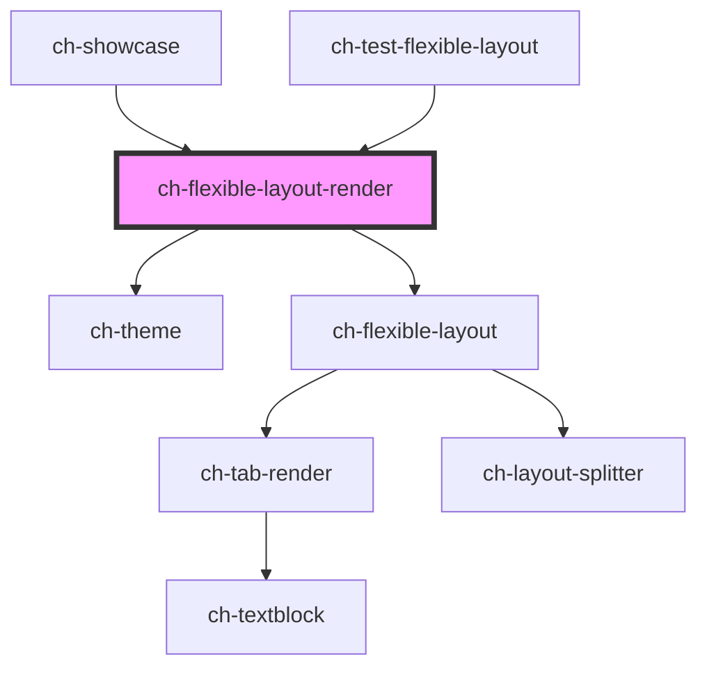

# ch-flexible-layout-render

## Table of Contents

- [Overview](#overview)
- [Features](#features)
- [Use when](#use-when)
- [Do not use when](#do-not-use-when)
- [Accessibility](#accessibility)
- [Usage](./docs/usage.md)
- [Properties](#properties)
- [Events](#events)
- [Methods](#methods)
  - [`addSiblingView`](#addsiblingviewparentgroup-string-siblingitem-string-placedinthesibling-before--after-viewinfo-flexiblelayoutleafmodel-takehalfthespaceofthesiblingitem-boolean--promiseboolean)
  - [`addWidget`](#addwidgetleafid-string-widget-flexiblelayoutwidget-selectwidget-boolean--promisevoid)
  - [`removeView`](#removeviewleafid-string-removerenderedwidgets-boolean--promiseflexiblelayoutviewremoveresult)
  - [`removeWidget`](#removewidgetwidgetid-string--promisevoid)
  - [`updateSelectedWidget`](#updateselectedwidgetparentleafid-string-newselectedwidgetid-string--promisevoid)
  - [`updateViewInfo`](#updateviewinfoviewid-string-properties-partialomitflexiblelayoutleafconfigurationtabbed-selectedwidgetid--widget--widgets--promisevoid)
  - [`updateWidgetInfo`](#updatewidgetinfowidgetid-string-properties-partialomitflexiblelayoutwidget-id--wasrendered--promisevoid)
- [Slots](#slots)
- [Dependencies](#dependencies)
  - [Used by](#used-by)
  - [Depends on](#depends-on)
  - [Graph](#graph)
- [Styling](./docs/styling.md)

<!-- Auto Generated Below -->

## Overview

The `ch-flexible-layout-render` component is a high-level shell for building IDE-style dock layouts composed of lightweight, modular widgets.

## Features
 - Hierarchical model of groups and leaves, where each leaf can host a single widget or a tabbed collection of widgets.
 - Coordinates `ch-flexible-layout` and `ch-layout-splitter` primitives for draggable, resizable, and reorderable views.
 - Add, remove, and reorder widgets and views at runtime via public methods.
 - Slotted widget mode (`slottedWidgets`) projects widget content from outside the component via named slots.
 - Close button support for tabbed leaves.
 - Configurable CSS containment and overflow per widget.
 - Theme support via the `theme` property.
 - Emits `renderedWidgetsChange` whenever the set of visible widgets changes, enabling host apps to lazy-mount or unmount content.

## Use when
 - Building a complex, multi-pane workspace (code editors, dashboards, admin panels) where users can rearrange, close, and add views at runtime.
 - Building IDE-like or dashboard interfaces with multiple movable, resizable widget panes.

## Do not use when
 - Building simple, static layouts -- prefer `ch-layout-splitter` or CSS Grid instead.
 - A simple fixed two-panel layout is sufficient -- prefer `ch-layout-splitter` directly.

## Accessibility
 - Tab reordering in `"tabbed"` leaves supports keyboard-initiated drag via the inner `ch-tab` component.
 - Focus management is delegated to the underlying `ch-flexible-layout` and `ch-tab` primitives.
 - Close actions are cancelable through the `widgetClose` event, allowing confirmation dialogs before removal.

## Properties

| Property         | Attribute         | Description                                                                                                                                                                                                                                                                                                                                                                                                                                          | Type                                                                                                                                                                                                                                                                                                                                                                                                                                                                               | Default     |
| ---------------- | ----------------- | ---------------------------------------------------------------------------------------------------------------------------------------------------------------------------------------------------------------------------------------------------------------------------------------------------------------------------------------------------------------------------------------------------------------------------------------------------- | ---------------------------------------------------------------------------------------------------------------------------------------------------------------------------------------------------------------------------------------------------------------------------------------------------------------------------------------------------------------------------------------------------------------------------------------------------------------------------------- | ----------- |
| `closeButton`    | `close-button`    | `true` to display a close button for the `"tabbed"` type leafs. When a close button is clicked, the `widgetClose` event is emitted. The close can be prevented by calling `event.preventDefault()`. Has no effect on `"single-content"` type leaves.                                                                                                                                                                                                 | `boolean`                                                                                                                                                                                                                                                                                                                                                                                                                                                                          | `false`     |
| `contain`        | `contain`         | Same as the contain CSS property. This property indicates that an widget and its contents are, as much as possible, independent from the rest of the document tree. Containment enables isolating a subsection of the DOM, providing performance benefits by limiting calculations of layout, style, paint, size, or any combination to a DOM subtree rather than the entire page. Containment can also be used to scope CSS counters and quotes.    | `"content" \| "inline-size" \| "layout" \| "none" \| "paint" \| "size" \| "strict" \| "style"`                                                                                                                                                                                                                                                                                                                                                                                     | `"none"`    |
| `dragOutside`    | `drag-outside`    | When the `"tabbed"` type leaves are sortable, the items can be dragged outside of their tab-list into a different leaf's drop zone.  This property lets you specify if this behavior is enabled. Requires `sortable` to be `true`; otherwise this property has no effect.                                                                                                                                                                            | `boolean`                                                                                                                                                                                                                                                                                                                                                                                                                                                                          | `false`     |
| `model`          | --                | Specifies the distribution of the items in the flexible layout. The model is a tree of groups and leaves describing the hierarchical pane structure. When set to `null` or `undefined`, the component renders nothing.  Changing this property at runtime fully rebuilds the internal state. Previously rendered widgets that still exist in the new model will keep their render state; widgets removed from the model are discarded.               | `Omit<LayoutSplitterModel, "items"> & { items: FlexibleLayoutItemModel[]; }`                                                                                                                                                                                                                                                                                                                                                                                                       | `undefined` |
| `overflow`       | `overflow`        | Same as the overflow CSS property. This property sets the desired behavior when content does not fit in the widget's padding box (overflows) in the horizontal and/or vertical direction.                                                                                                                                                                                                                                                            | `CssOverflowProperty \| "auto auto" \| "auto hidden" \| "auto clip" \| "auto scroll" \| "auto visible" \| "hidden auto" \| "hidden hidden" \| "hidden clip" \| "hidden scroll" \| "hidden visible" \| "clip auto" \| "clip hidden" \| "clip clip" \| "clip scroll" \| "clip visible" \| "scroll auto" \| "scroll hidden" \| "scroll clip" \| "scroll scroll" \| "scroll visible" \| "visible auto" \| "visible hidden" \| "visible clip" \| "visible scroll" \| "visible visible"` | `"visible"` |
| `renders`        | --                | A dictionary mapping render IDs to render functions. Each function receives a `FlexibleLayoutWidget` and returns a JSX element to display inside the widget's container.  When a widget's `renderId` is set, the component looks up this dictionary using that ID; otherwise it falls back to the widget's `id`. If no matching render is found, an error is logged to the console.  Not used for slotted widgets (those projected via named slots). | `{ [key: string]: (widgetInfo: FlexibleLayoutWidget) => any; }`                                                                                                                                                                                                                                                                                                                                                                                                                    | `undefined` |
| `slottedWidgets` | `slotted-widgets` | Specifies whether widgets are rendered outside of the `ch-flexible-layout-render` by default by projecting a named slot.  When `true`, each visible widget is rendered as a `<slot name="{widgetId}">` so the host application can provide content from outside the shadow DOM. Individual widgets can override this default via their own `slot` property.                                                                                          | `boolean`                                                                                                                                                                                                                                                                                                                                                                                                                                                                          | `false`     |
| `sortable`       | `sortable`        | `true` to enable sorting the tab buttons in the `"tabbed"` type leaves by dragging them in the tab-list.  If `false`, the tab buttons cannot be dragged out either, regardless of the `dragOutside` property value.                                                                                                                                                                                                                                  | `boolean`                                                                                                                                                                                                                                                                                                                                                                                                                                                                          | `false`     |
| `theme`          | `theme`           | Specifies the theme to be used for rendering the control. If `undefined`, no theme will be applied.                                                                                                                                                                                                                                                                                                                                                  | `ThemeItemBaseModel & { styleSheet: string; } \| ThemeItemBaseModel & { url?: string; } \| ThemeItemModel[] \| string \| string[]`                                                                                                                                                                                                                                                                                                                                                 | `undefined` |

## Events

| Event                   | Description                                                                                                                                                                                                                                                                                                                   | Type                                                      |
| ----------------------- | ----------------------------------------------------------------------------------------------------------------------------------------------------------------------------------------------------------------------------------------------------------------------------------------------------------------------------- | --------------------------------------------------------- |
| `renderedWidgetsChange` | Emitted every time the set of rendered widgets changes (after each render cycle). The payload contains two arrays:  - `rendered`: widget IDs rendered internally by the component.  - `slotted`: widget IDs projected via named slots.  Not emitted when the rendered set is identical to the previous cycle. Not cancelable. | `CustomEvent<{ rendered: string[]; slotted: string[]; }>` |
| `widgetClose`           | Emitted when the user presses the close button on a widget tab. The event is cancelable: calling `event.preventDefault()` prevents the widget from being removed, allowing the host to show a confirmation dialog or perform cleanup before removal.  Payload contains `widgetId` and `viewId` identifying the closed widget. | `CustomEvent<{ widgetId: string; viewId: string; }>`      |

## Methods

### `addSiblingView(parentGroup: string, siblingItem: string, placedInTheSibling: "before" | "after", viewInfo: FlexibleLayoutLeafModel, takeHalfTheSpaceOfTheSiblingItem: boolean) => Promise<boolean>`

Adds a new leaf view as a sibling of an existing item within a group.
The new view takes half the space of the specified sibling when
`takeHalfTheSpaceOfTheSiblingItem` is `true`.

Returns `true` if the view was added successfully, `false` if the
parent group or sibling item was not found.

#### Parameters

| Name                               | Type                                                                                                   | Description |
| ---------------------------------- | ------------------------------------------------------------------------------------------------------ | ----------- |
| `parentGroup`                      | `string`                                                                                               |             |
| `siblingItem`                      | `string`                                                                                               |             |
| `placedInTheSibling`               | `"after" \| "before"`                                                                                  |             |
| `viewInfo`                         | `LayoutSplitterLeafModel & { accessibleRole?: ViewAccessibleRole; } & FlexibleLayoutLeafConfiguration` |             |
| `takeHalfTheSpaceOfTheSiblingItem` | `boolean`                                                                                              |             |

#### Returns

Type: `Promise<boolean>`

### `addWidget(leafId: string, widget: FlexibleLayoutWidget, selectWidget?: boolean) => Promise<void>`

Adds a widget to an existing `"tabbed"` type leaf.
Only works if the parent leaf is `"tabbed"` type; no-ops for
`"single-content"` leaves.
If a widget with the same ID already exists, this method has no effect.

By default, the newly added widget is selected (`selectWidget = true`).
Set `selectWidget` to `false` to add the widget without switching to it.

To add a widget in a `"single-content"` type leaf, use the
`addSiblingView` method instead.

#### Parameters

| Name           | Type                                                                                                                                                                                                                                     | Description |
| -------------- | ---------------------------------------------------------------------------------------------------------------------------------------------------------------------------------------------------------------------------------------- | ----------- |
| `leafId`       | `string`                                                                                                                                                                                                                                 |             |
| `widget`       | `{ addWrapper?: boolean; conserveRenderState?: boolean; id: string; accessibleName?: string; disabled?: boolean; name?: string; startImgSrc?: string; startImgType?: ImageRender; wasRendered?: boolean; } & FlexibleLayoutWidgetRender` |             |
| `selectWidget` | `boolean`                                                                                                                                                                                                                                |             |

#### Returns

Type: `Promise<void>`

### `removeView(leafId: string, removeRenderedWidgets: boolean) => Promise<FlexibleLayoutViewRemoveResult>`

Removes a leaf view and optionally all its rendered widgets.
The space freed by the removed view is given to the closest sibling.

Only works on `"tabbed"` type leaves. Returns `{ success: false }` if
the leaf does not exist or is `"single-content"` type.

When `removeRenderedWidgets` is `true`, widget render state is
destroyed (unless the widget has `conserveRenderState === true`).

#### Parameters

| Name                    | Type      | Description |
| ----------------------- | --------- | ----------- |
| `leafId`                | `string`  |             |
| `removeRenderedWidgets` | `boolean` |             |

#### Returns

Type: `Promise<FlexibleLayoutViewRemoveResult>`

### `removeWidget(widgetId: string) => Promise<void>`

Removes a widget from a `"tabbed"` type leaf by its widget ID.
Only works if the parent leaf is `"tabbed"` type; no-ops otherwise.

If the removed widget was the only one in the leaf, the entire view
is destroyed via `removeView`. If it was the selected widget, the
adjacent widget is automatically selected.

To remove a widget from a `"single-content"` type leaf, use the
`removeView` method instead.

#### Parameters

| Name       | Type     | Description |
| ---------- | -------- | ----------- |
| `widgetId` | `string` |             |

#### Returns

Type: `Promise<void>`

### `updateSelectedWidget(parentLeafId: string, newSelectedWidgetId: string) => Promise<void>`

Updates the selected (visible) widget in a `"tabbed"` type leaf.
Only works if the parent leaf is `"tabbed"` type and the specified
widget belongs to that leaf. No-ops if the widget is already selected,
the widget is not found, or the leaf is `"single-content"` type.

#### Parameters

| Name                  | Type     | Description |
| --------------------- | -------- | ----------- |
| `parentLeafId`        | `string` |             |
| `newSelectedWidgetId` | `string` |             |

#### Returns

Type: `Promise<void>`

### `updateViewInfo(viewId: string, properties: Partial<Omit<FlexibleLayoutLeafConfigurationTabbed, "selectedWidgetId" | "widget" | "widgets">>) => Promise<void>`

Updates leaf-level configuration properties (e.g., `tabListPosition`,
`dragBar`) for the view identified by `viewId`.

The `type` field in the `properties` argument must match the leaf's
current type; otherwise the update is silently skipped.
The `selectedWidgetId`, `widget`, and `widgets` fields cannot be
changed through this method.

#### Parameters

| Name         | Type                                                                                                                                                                                               | Description |
| ------------ | -------------------------------------------------------------------------------------------------------------------------------------------------------------------------------------------------- | ----------- |
| `viewId`     | `string`                                                                                                                                                                                           |             |
| `properties` | `{ disabled?: boolean; type?: "tabbed"; closeButton?: boolean; dragOutside?: boolean; sortable?: boolean; showCaptions?: boolean; tabButtonHidden?: boolean; tabListPosition?: TabListPosition; }` |             |

#### Returns

Type: `Promise<void>`

### `updateWidgetInfo(widgetId: string, properties: Partial<Omit<FlexibleLayoutWidget, "id" | "wasRendered">>) => Promise<void>`

Updates metadata properties on an existing widget (e.g., `name`,
`startImgSrc`, `slot`). The `id` and `wasRendered` fields cannot be
changed. No-ops if the widget is not found.

Triggers a re-render of both the widget container and its parent leaf.

#### Parameters

| Name         | Type                                                                                                                                                                                                                                                                                                                                                                                                                                                                                                                                                                                                                                                                                                                                                          | Description |
| ------------ | ------------------------------------------------------------------------------------------------------------------------------------------------------------------------------------------------------------------------------------------------------------------------------------------------------------------------------------------------------------------------------------------------------------------------------------------------------------------------------------------------------------------------------------------------------------------------------------------------------------------------------------------------------------------------------------------------------------------------------------------------------------- | ----------- |
| `widgetId`   | `string`                                                                                                                                                                                                                                                                                                                                                                                                                                                                                                                                                                                                                                                                                                                                                      |             |
| `properties` | `{ name?: string; slot?: boolean; disabled?: boolean; overflow?: CssOverflowProperty \| "auto auto" \| "auto hidden" \| "auto clip" \| "auto scroll" \| "auto visible" \| "hidden auto" \| "hidden hidden" \| "hidden clip" \| "hidden scroll" \| "hidden visible" \| "clip auto" \| "clip hidden" \| "clip clip" \| "clip scroll" \| "clip visible" \| "scroll auto" \| "scroll hidden" \| "scroll clip" \| "scroll scroll" \| "scroll visible" \| "visible auto" \| "visible hidden" \| "visible clip" \| "visible scroll" \| "visible visible"; accessibleName?: string; startImgSrc?: string; startImgType?: ImageRender; closeButton?: boolean; contain?: CssContainProperty; addWrapper?: boolean; conserveRenderState?: boolean; renderId?: string; }` |             |

#### Returns

Type: `Promise<void>`

## Slots

| Slot           | Description                                                                                                                                                                                                                                         |
| -------------- | --------------------------------------------------------------------------------------------------------------------------------------------------------------------------------------------------------------------------------------------------- |
| `"{widgetId}"` | Named slot for each widget. Each widget gets a named slot whose name equals the widget's `id`. Slots are only projected when `slottedWidgets` is `true` (or the individual widget's `slot` property is `true`) and the widget is currently visible. |

## Dependencies

### Used by

 - [ch-showcase](../../showcase/assets/components)
 - [ch-test-flexible-layout](../test/test-flexible-layout)

### Depends on

- [ch-theme](../theme)
- [ch-flexible-layout](./internal/flexible-layout)

### Graph

```mermaid
graph TD;
  ch-flexible-layout-render --> ch-theme
  ch-flexible-layout-render --> ch-flexible-layout
  ch-flexible-layout --> ch-tab-render
  ch-flexible-layout --> ch-layout-splitter
  ch-tab-render --> ch-textblock
  ch-showcase --> ch-flexible-layout-render
  ch-test-flexible-layout --> ch-flexible-layout-render
  style ch-flexible-layout-render fill:#f9f,stroke:#333,stroke-width:4px
```

----------------------------------------------

*Built with [StencilJS](https://stenciljs.com/)*
