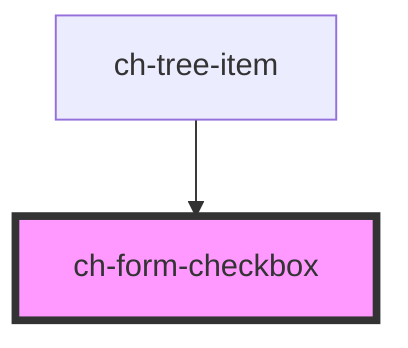

# ch-form-checkbox

<!-- Auto Generated Below -->

## Properties

| Property        | Attribute       | Description                                                          | Type      | Default     |
| --------------- | --------------- | -------------------------------------------------------------------- | --------- | ----------- |
| `checkboxId`    | `checkbox-id`   | The checkbox id                                                      | `string`  | `undefined` |
| `checked`       | `checked`       | The presence of this attribute makes the checkbox checked by default | `boolean` | `false`     |
| `disabled`      | `disabled`      | The presence of this attribute disables the checkbox                 | `boolean` | `false`     |
| `indeterminate` | `indeterminate` | The presence of this attribute makes the checkbox indeterminate      | `boolean` | `false`     |
| `label`         | `label`         | The checkbox label                                                   | `string`  | `undefined` |
| `name`          | `name`          | The checkbox name                                                    | `string`  | `undefined` |
| `value`         | `value`         | The checkbox value                                                   | `string`  | `undefined` |

## Events

| Event    | Description | Type               |
| -------- | ----------- | ------------------ |
| `change` |             | `CustomEvent<any>` |

## Dependencies

### Used by

 - [ch-tree-item](../tree-item)

### Graph

----------------------------------------------

*Built with [StencilJS](https://stenciljs.com/)*
