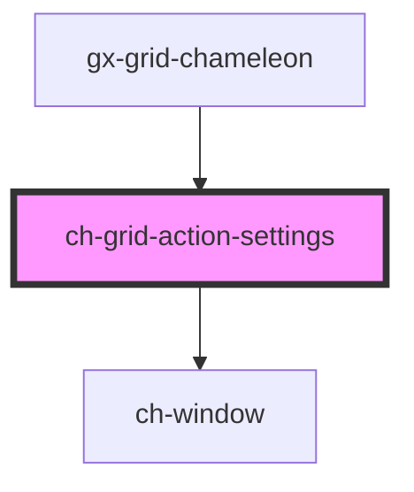

# ch-grid-action-settings

<!-- Auto Generated Below -->

## Properties

| Property   | Attribute  | Description | Type      | Default     |
| ---------- | ---------- | ----------- | --------- | ----------- |
| `disabled` | `disabled` |             | `boolean` | `undefined` |

## Dependencies

### Used by

- [gx-grid-chameleon](../../gx-grid)

### Depends on

- [ch-window](../../window)

### Graph

---

_Built with [StencilJS](https://stenciljs.com/)_
