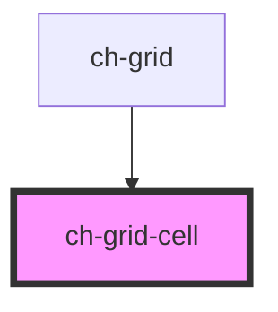

# ch-grid-cell

<!-- Auto Generated Below -->

## Dependencies

### Used by

- [ch-grid](../grid)

### Graph

```mermaid
graph TD;
  ch-grid --> ch-grid-cell
  style ch-grid-cell fill:#f9f,stroke:#333,stroke-width:4px
```

---

_Built with [StencilJS](https://stenciljs.com/)_
