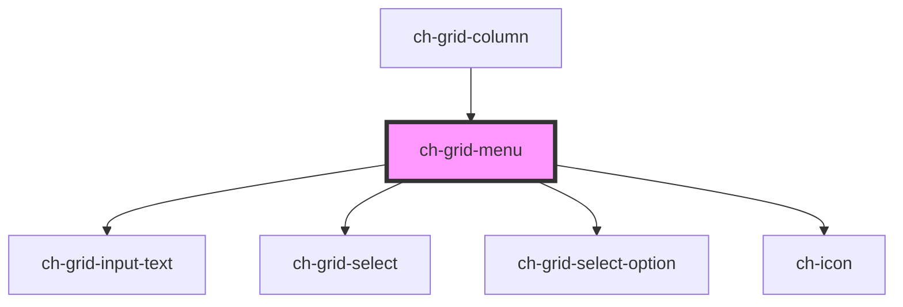

# ch-grid-menu

<!-- Auto Generated Below -->

## Properties

| Property       | Attribute    | Description                                                         | Type                                                                                            | Default     |
| -------------- | ------------ | ------------------------------------------------------------------- | ----------------------------------------------------------------------------------------------- | ----------- |
| `colId`        | `col-id`     | The columnd id                                                      | `string`                                                                                        | `""`        |
| `colType`      | `col-type`   | The column data type                                                | `"action" \| "boolean" \| "custom" \| "date" \| "date-time" \| "image" \| "number" \| "string"` | `undefined` |
| `colsOrder`    | --           | Information about the columns order                                 | `ChGridColumn[]`                                                                                | `[]`        |
| `filterable`   | `filterable` | The presence of this atribute displays a filter on the menu         | `boolean`                                                                                       | `false`     |
| `freezedCols`  | --           | An array containing information about the freezed columns           | `Object[]`                                                                                      | `[]`        |
| `hideableCols` | --           | An array containing information about the hideable columns          | `Object[]`                                                                                      | `[]`        |
| `lastCol`      | `last-col`   | Whether this menu belongs to the last column                        | `boolean`                                                                                       | `false`     |
| `showMenu`     | `show-menu`  | If true, it shows the menu                                          | `boolean`                                                                                       | `false`     |
| `sortable`     | `sortable`   | The presence of this atribute displays an option to sort the column | `boolean`                                                                                       | `true`      |

## Events

| Event              | Description                            | Type               |
| ------------------ | -------------------------------------- | ------------------ |
| `dateRangeChanged` | Emmits the dateRangeChanged event      | `CustomEvent<any>` |
| `freezeColumn`     | Emmits the "freeze column" event       | `CustomEvent<any>` |
| `hideMenu`         | Emmits the hideMenu event              | `CustomEvent<any>` |
| `moveCol`          | Emmits the move column event           | `CustomEvent<any>` |
| `sortChanged`      | Emmits the sorting event               | `CustomEvent<any>` |
| `toggledColumn`    | Emmits toggled column (hidden/visible) | `CustomEvent<any>` |
| `unfreezeColumn`   | Emmits the "unfreeze column" event     | `CustomEvent<any>` |

## Dependencies

### Used by

- [ch-grid-column](../grid-column)

### Depends on

- [ch-grid-input-text](../grid-input-text)
- [ch-grid-select](../grid-select)
- [ch-grid-select-option](../grid-select-option)
- [ch-icon](../icon)

### Graph

---

_Built with [StencilJS](https://stenciljs.com/)_
