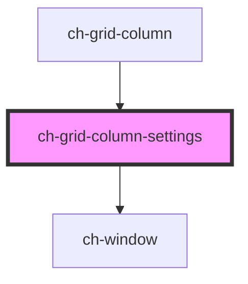

# ch-grid-menu-columns

<!-- Auto Generated Below -->

## Properties

| Property | Attribute | Description | Type           | Default     |
| -------- | --------- | ----------- | -------------- | ----------- |
| `column` | --        |             | `ChGridColumn` | `undefined` |
| `show`   | `show`    |             | `boolean`      | `false`     |

## Events

| Event                  | Description | Type               |
| ---------------------- | ----------- | ------------------ |
| `settingsCloseClicked` |             | `CustomEvent<any>` |

## Dependencies

### Used by

 - [ch-grid-column](../grid-column)

### Depends on

- [ch-window](../window)

### Graph

----------------------------------------------

*Built with [StencilJS](https://stenciljs.com/)*
