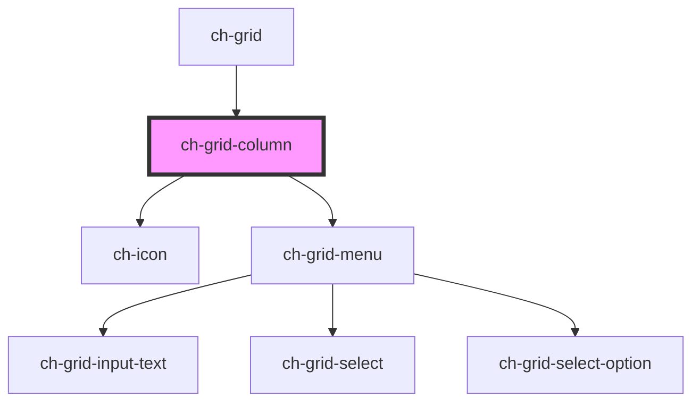

# ch-grid-column

<!-- Auto Generated Below -->

## Properties

| Property      | Attribute      | Description                                                                                                                                                             | Type                                                                                            | Default                      |
| ------------- | -------------- | ----------------------------------------------------------------------------------------------------------------------------------------------------------------------- | ----------------------------------------------------------------------------------------------- | ---------------------------- |
| `colId`       | `col-id`       | The columnd id (required)                                                                                                                                               | `string`                                                                                        | `null`                       |
| `colType`     | `col-type`     | The column data type                                                                                                                                                    | `"action" \| "boolean" \| "custom" \| "date" \| "date-time" \| "image" \| "number" \| "string"` | `undefined`                  |
| `filterable`  | `filterable`   | The presence of this atribute displays a filter on the menu                                                                                                             | `boolean`                                                                                       | `false`                      |
| `freezed`     | `freezed`      | The prescence of this property makes this column freezed                                                                                                                | `boolean`                                                                                       | `false`                      |
| `hidden`      | `hidden`       | The presence of this attribute hides the column                                                                                                                         | `boolean`                                                                                       | `false`                      |
| `hideable`    | `hideable`     | The presence of this attribute makes this column hideable                                                                                                               | `boolean`                                                                                       | `false`                      |
| `indent`      | `indent`       | The presence of this attribute sets the indentation on this column (You should apply this attribute on one column only, usually on the first column that displays data) | `boolean`                                                                                       | `false`                      |
| `showOptions` | `show-options` | Displays a menu with options                                                                                                                                            | `boolean`                                                                                       | `true`                       |
| `size`        | `size`         | The column size                                                                                                                                                         | `string`                                                                                        | `"minmax(max-content,auto)"` |

## Dependencies

### Used by

- [ch-grid](../grid)

### Depends on

- [ch-icon](../icon)
- [ch-grid-menu](../grid-column-menu)

### Graph

---

_Built with [StencilJS](https://stenciljs.com/)_
