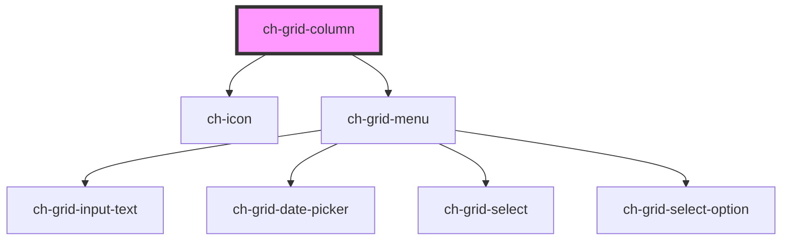

# ch-grid-column

<!-- Auto Generated Below -->

## Properties

| Property      | Attribute      | Description                                                 | Type                                                                                            | Default     |
| ------------- | -------------- | ----------------------------------------------------------- | ----------------------------------------------------------------------------------------------- | ----------- |
| `colId`       | `col-id`       | The columnd id                                              | `string`                                                                                        | `""`        |
| `colType`     | `col-type`     | The column data type                                        | `"action" \| "boolean" \| "custom" \| "date" \| "date-time" \| "image" \| "number" \| "string"` | `undefined` |
| `filterable`  | `filterable`   | The presence of this atribute displays a filter on the menu | `boolean`                                                                                       | `false`     |
| `showOptions` | `show-options` | Displays a menu with options                                | `boolean`                                                                                       | `true`      |

## Dependencies

### Depends on

- [ch-icon](../icon)
- [ch-grid-menu](../grid-menu)

### Graph

---

_Built with [StencilJS](https://stenciljs.com/)_
