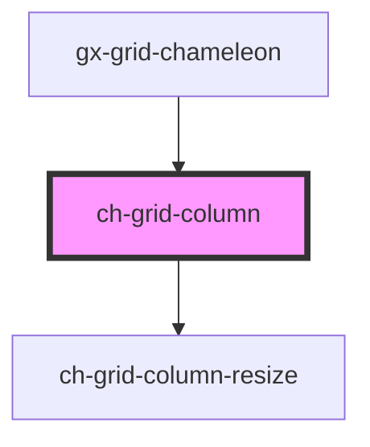

# ch-grid-column

<!-- Auto Generated Below -->

## Properties

| Property               | Attribute                | Description | Type      | Default     |
| ---------------------- | ------------------------ | ----------- | --------- | ----------- |
| `columnId`             | `column-id`              |             | `string`  | `undefined` |
| `columnName`           | `column-name`            |             | `string`  | `undefined` |
| `displayObserverClass` | `display-observer-class` |             | `string`  | `undefined` |
| `hidden`               | `hidden`                 |             | `boolean` | `false`     |
| `hideable`             | `hideable`               |             | `boolean` | `true`      |
| `order`                | `order`                  |             | `number`  | `undefined` |
| `physicalOrder`        | `physical-order`         |             | `number`  | `undefined` |
| `resizeable`           | `resizeable`             |             | `boolean` | `true`      |
| `resizing`             | `resizing`               |             | `boolean` | `undefined` |
| `size`                 | `size`                   |             | `string`  | `undefined` |

## Events

| Event                  | Description | Type                                 |
| ---------------------- | ----------- | ------------------------------------ |
| `columnDragEnded`      |             | `CustomEvent<ChGridColumnDragEvent>` |
| `columnDragging`       |             | `CustomEvent<ChGridColumnDragEvent>` |
| `columnDragStarted`    |             | `CustomEvent<ChGridColumnDragEvent>` |
| `columnVisibleChanged` |             | `CustomEvent<any>`                   |

## Shadow Parts

| Part                 | Description |
| -------------------- | ----------- |
| `"bar"`              |             |
| `"bar-menu"`         |             |
| `"bar-menu-button"`  |             |
| `"bar-name"`         |             |
| `"bar-resize"`       |             |
| `"bar-resize-split"` |             |
| `"bar-sort"`         |             |

## Dependencies

### Used by

 - [gx-grid-chameleon](../gx-grid)

### Depends on

- [ch-grid-column-resize](../grid-column-resize)

### Graph

----------------------------------------------

*Built with [StencilJS](https://stenciljs.com/)*
