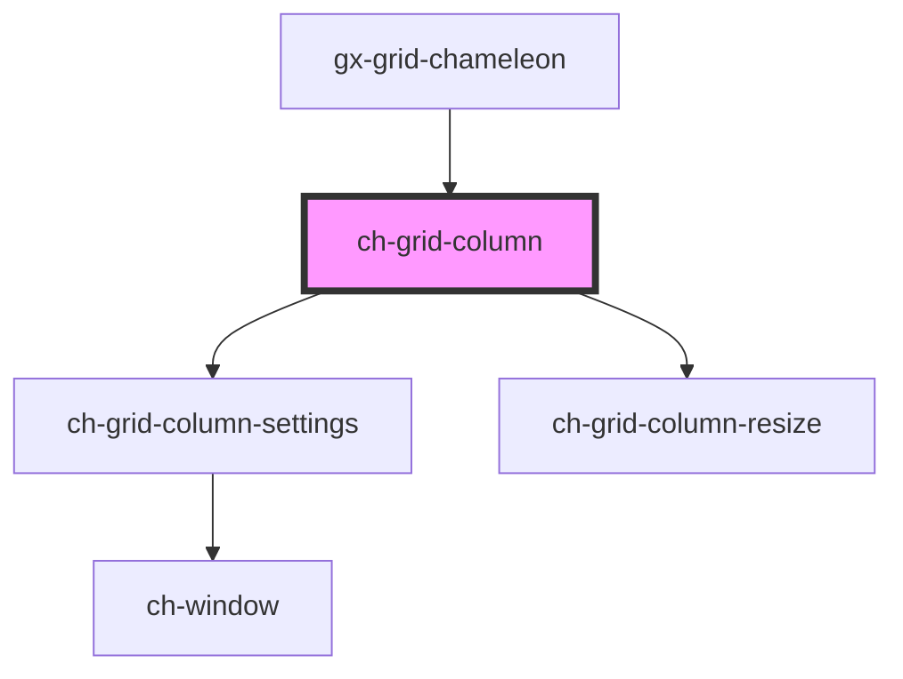

# ch-grid-column

<!-- Auto Generated Below -->

## Properties

| Property               | Attribute                | Description | Type                             | Default     |
| ---------------------- | ------------------------ | ----------- | -------------------------------- | ----------- |
| `columnIconUrl`        | `column-icon-url`        |             | `string`                         | `undefined` |
| `columnId`             | `column-id`              |             | `string`                         | `undefined` |
| `columnName`           | `column-name`            |             | `string`                         | `undefined` |
| `columnNamePosition`   | `column-name-position`   |             | `"text" \| "title"`              | `"text"`    |
| `columnType`           | `column-type`            |             | `"select" \| "simple" \| "tree"` | `"simple"`  |
| `displayObserverClass` | `display-observer-class` |             | `string`                         | `undefined` |
| `freeze`               | `freeze`                 |             | `"end" \| "start"`               | `undefined` |
| `hidden`               | `hidden`                 |             | `boolean`                        | `false`     |
| `hideable`             | `hideable`               |             | `boolean`                        | `true`      |
| `order`                | `order`                  |             | `number`                         | `undefined` |
| `physicalOrder`        | `physical-order`         |             | `number`                         | `undefined` |
| `resizeable`           | `resizeable`             |             | `boolean`                        | `true`      |
| `resizing`             | `resizing`               |             | `boolean`                        | `undefined` |
| `settingable`          | `settingable`            |             | `boolean`                        | `true`      |
| `showSettings`         | `show-settings`          |             | `boolean`                        | `false`     |
| `size`                 | `size`                   |             | `string`                         | `undefined` |
| `sortDirection`        | `sort-direction`         |             | `"asc" \| "desc"`                | `undefined` |
| `sortable`             | `sortable`               |             | `boolean`                        | `true`      |

## Events

| Event                   | Description | Type                                            |
| ----------------------- | ----------- | ----------------------------------------------- |
| `columnDragEnded`       |             | `CustomEvent<ChGridColumnDragEvent>`            |
| `columnDragging`        |             | `CustomEvent<ChGridColumnDragEvent>`            |
| `columnDragStarted`     |             | `CustomEvent<ChGridColumnDragEvent>`            |
| `columnHiddenChanged`   |             | `CustomEvent<ChGridColumnHiddenChangedEvent>`   |
| `columnOrderChanged`    |             | `CustomEvent<ChGridColumnOrderChangedEvent>`    |
| `columnSelectorClicked` |             | `CustomEvent<ChGridColumnSelectorClickedEvent>` |
| `columnSizeChanged`     |             | `CustomEvent<ChGridColumnSizeChangedEvent>`     |
| `columnSizeChanging`    |             | `CustomEvent<ChGridColumnSizeChangedEvent>`     |
| `columnSortChanged`     |             | `CustomEvent<ChGridColumnSortChangedEvent>`     |

## Shadow Parts

| Part                    | Description |
| ----------------------- | ----------- |
| `"bar"`                 |             |
| `"bar-name"`            |             |
| `"bar-name-icon"`       |             |
| `"bar-name-text"`       |             |
| `"bar-resize"`          |             |
| `"bar-resize-split"`    |             |
| `"bar-selector"`        |             |
| `"bar-settings"`        |             |
| `"bar-settings-button"` |             |
| `"bar-sort"`            |             |
| `"bar-sort-ascending"`  |             |
| `"bar-sort-descending"` |             |
| `"selector"`            |             |
| `"selector-label"`      |             |

## Dependencies

### Used by

 - [gx-grid-chameleon](../gx-grid)

### Depends on

- [ch-grid-column-settings](../grid-column-settings)
- [ch-grid-column-resize](../grid-column-resize)

### Graph

----------------------------------------------

*Built with [StencilJS](https://stenciljs.com/)*
