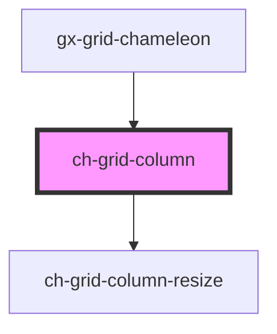

# ch-grid-column

<!-- Auto Generated Below -->

## Properties

| Property     | Attribute    | Description | Type      | Default     |
| ------------ | ------------ | ----------- | --------- | ----------- |
| `columnId`   | `column-id`  |             | `string`  | `undefined` |
| `hideable`   | `hideable`   |             | `boolean` | `undefined` |
| `order`      | `order`      |             | `number`  | `undefined` |
| `resizeable` | `resizeable` |             | `boolean` | `true`      |
| `resizing`   | `resizing`   |             | `boolean` | `undefined` |
| `size`       | `size`       |             | `string`  | `undefined` |

## Events

| Event                  | Description | Type               |
| ---------------------- | ----------- | ------------------ |
| `columnVisibleChanged` |             | `CustomEvent<any>` |

## Dependencies

### Used by

- [gx-grid-chameleon](../gx-grid)

### Depends on

- [ch-grid-column-resize](../grid-column-resize)

### Graph

---

_Built with [StencilJS](https://stenciljs.com/)_
