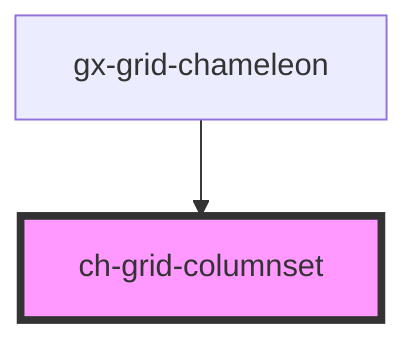

# ch-grid-columnset

<!-- Auto Generated Below -->

## Dependencies

### Used by

- [gx-grid-chameleon](../gx-grid)

### Graph

```mermaid
graph TD;
  gx-grid-chameleon --> ch-grid-columnset
  style ch-grid-columnset fill:#f9f,stroke:#333,stroke-width:4px
```

---

_Built with [StencilJS](https://stenciljs.com/)_
