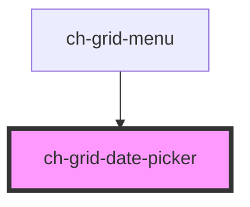

# ch-date-picker

<!-- Auto Generated Below -->

## Properties

| Property          | Attribute           | Description                                                         | Type      | Default        |
| ----------------- | ------------------- | ------------------------------------------------------------------- | --------- | -------------- |
| `alwaysShow`      | `always-show`       | The presence of this attribute makes the date-picker always visible | `boolean` | `false`        |
| `colId`           | `col-id`            | The columnd id that this datepicker belongs to                      | `string`  | `undefined`    |
| `datePickerClass` | `date-picker-class` | The date picker class                                               | `string`  | `undefined`    |
| `datePickerId`    | `date-picker-id`    | The date picker id                                                  | `string`  | `undefined`    |
| `defaultDate`     | `default-date`      | initial date                                                        | `string`  | `undefined`    |
| `label`           | `label`             | The datepicker label                                                | `string`  | `undefined`    |
| `maxDate`         | `max-date`          | The max. date                                                       | `string`  | `"3000, 1, 1"` |
| `maxWidth`        | `max-width`         | The max. width                                                      | `string`  | `"100%"`       |
| `minDate`         | `min-date`          | The min. date                                                       | `string`  | `"1000, 1, 1"` |
| `noWeekends`      | `no-weekends`       | no weekends available                                               | `boolean` | `false`        |

## Events

| Event              | Description              | Type               |
| ------------------ | ------------------------ | ------------------ |
| `dateRangeChanged` | Emmits the sorting event | `CustomEvent<any>` |

## Dependencies

### Used by

- [ch-grid-menu](../grid-column-menu)

### Graph

---

_Built with [StencilJS](https://stenciljs.com/)_
