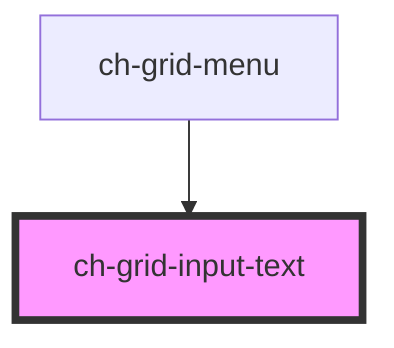

# ch-grid-input-text

<!-- Auto Generated Below -->

## Properties

| Property      | Attribute     | Description                          | Type     | Default     |
| ------------- | ------------- | ------------------------------------ | -------- | ----------- |
| `colId`       | `col-id`      | The columnd id this input belongs to | `string` | `""`        |
| `placeholder` | `placeholder` | The input placeholder                | `string` | `undefined` |

## Events

| Event               | Description            | Type               |
| ------------------- | ---------------------- | ------------------ |
| `inputValueChanged` | Emmits the input value | `CustomEvent<any>` |

## Dependencies

### Used by

- [ch-grid-menu](../grid-column-menu)

### Graph

---

_Built with [StencilJS](https://stenciljs.com/)_
