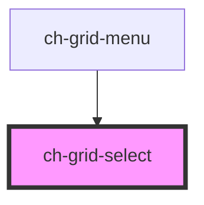

# gxg-grid-select

<!-- Auto Generated Below -->

## Properties

| Property | Attribute | Description                           | Type     | Default |
| -------- | --------- | ------------------------------------- | -------- | ------- |
| `colId`  | `col-id`  | The columnd id this select belongs to | `string` | `""`    |

## Events

| Event           | Description         | Type               |
| --------------- | ------------------- | ------------------ |
| `selectChanged` | Emmits select value | `CustomEvent<any>` |

## Dependencies

### Used by

- [ch-grid-menu](../grid-column-menu)

### Graph

---

_Built with [StencilJS](https://stenciljs.com/)_
