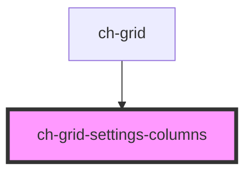

# ch-grid-settings-columns

<!-- Auto Generated Below -->

## Properties

| Property      | Attribute | Description | Type            | Default     |
| ------------- | --------- | ----------- | --------------- | ----------- |
| `gridManager` | --        |             | `ChGridManager` | `undefined` |

## Dependencies

### Used by

- [ch-grid](../../grid)

### Graph

---

_Built with [StencilJS](https://stenciljs.com/)_
