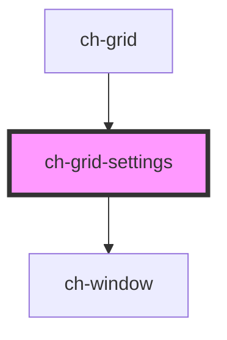

# ch-grid-settings

<!-- Auto Generated Below -->

## Properties

| Property      | Attribute | Description | Type            | Default     |
| ------------- | --------- | ----------- | --------------- | ----------- |
| `gridManager` | --        |             | `ChGridManager` | `undefined` |
| `show`        | `show`    |             | `boolean`       | `false`     |

## Events

| Event                  | Description | Type               |
| ---------------------- | ----------- | ------------------ |
| `settingsCloseClicked` |             | `CustomEvent<any>` |

## Dependencies

### Used by

 - [ch-grid](../grid)

### Depends on

- [ch-window](../window)

### Graph

----------------------------------------------

*Built with [StencilJS](https://stenciljs.com/)*
