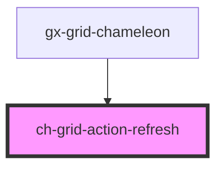

# ch-grid-action-refresh

<!-- Auto Generated Below -->

## Overview

The `ch-grid-action-refresh` component represents a refresh button for a grid action bar.

## Properties

| Property   | Attribute  | Description                                              | Type      | Default     |
| ---------- | ---------- | -------------------------------------------------------- | --------- | ----------- |
| `disabled` | `disabled` | Indicates whether the refresh button is disabled or not. | `boolean` | `undefined` |

## Events

| Event            | Description                                       | Type               |
| ---------------- | ------------------------------------------------- | ------------------ |
| `refreshClicked` | Event emitted when the refresh button is clicked. | `CustomEvent<any>` |

## Dependencies

### Used by

 - [gx-grid-chameleon](../../../gx-grid)

### Graph

----------------------------------------------

*Built with [StencilJS](https://stenciljs.com/)*
