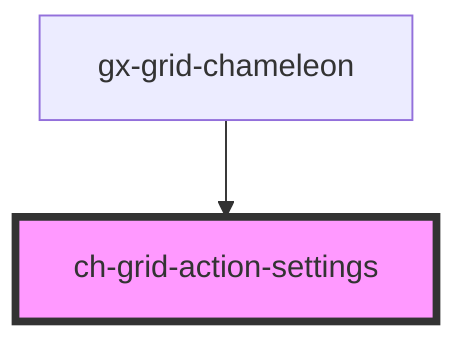

# ch-grid-action-settings

<!-- Auto Generated Below -->

## Properties

| Property   | Attribute  | Description                                               | Type      | Default     |
| ---------- | ---------- | --------------------------------------------------------- | --------- | ----------- |
| `disabled` | `disabled` | Indicates whether the settings button is disabled or not. | `boolean` | `undefined` |

## Events

| Event                 | Description                                        | Type               |
| --------------------- | -------------------------------------------------- | ------------------ |
| `settingsShowClicked` | Event emitted when the settings button is clicked. | `CustomEvent<any>` |

## Dependencies

### Used by

 - [gx-grid-chameleon](../../../gx-grid)

### Graph

----------------------------------------------

*Built with [StencilJS](https://stenciljs.com/)*
