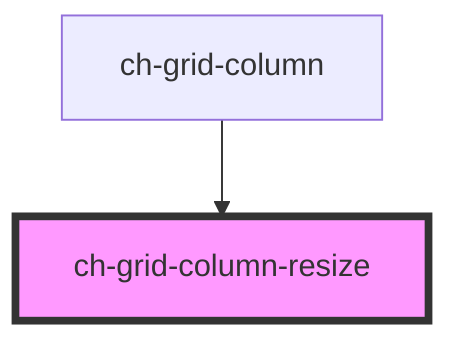

# ch-grid-column-resize

<!-- Auto Generated Below -->

## Properties

| Property              | Attribute | Description                               | Type                      | Default     |
| --------------------- | --------- | ----------------------------------------- | ------------------------- | ----------- |
| `column` _(required)_ | --        | The column element that is being resized. | `HTMLChGridColumnElement` | `undefined` |

## Events

| Event                  | Description                                               | Type               |
| ---------------------- | --------------------------------------------------------- | ------------------ |
| `columnResizeFinished` | Event emitted when the user finishes resizing the column. | `CustomEvent<any>` |
| `columnResizeStarted`  | Event emitted when the user starts resizing the column.   | `CustomEvent<any>` |

## Dependencies

### Used by

 - [ch-grid-column](..)

### Graph

----------------------------------------------

*Built with [StencilJS](https://stenciljs.com/)*
