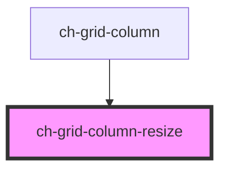

# ch-grid-column-resize

<!-- Auto Generated Below -->

## Properties

| Property              | Attribute | Description | Type                      | Default     |
| --------------------- | --------- | ----------- | ------------------------- | ----------- |
| `column` _(required)_ | --        |             | `HTMLChGridColumnElement` | `undefined` |

## Events

| Event                  | Description | Type               |
| ---------------------- | ----------- | ------------------ |
| `columnResizeFinished` |             | `CustomEvent<any>` |
| `columnResizeStarted`  |             | `CustomEvent<any>` |

## Dependencies

### Used by

 - [ch-grid-column](..)

### Graph

----------------------------------------------

*Built with [StencilJS](https://stenciljs.com/)*
