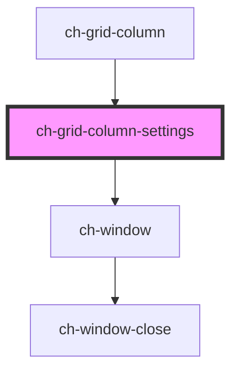

# ch-grid-menu-columns

<!-- Auto Generated Below -->

## Properties

| Property              | Attribute | Description | Type                      | Default     |
| --------------------- | --------- | ----------- | ------------------------- | ----------- |
| `column` _(required)_ | --        |             | `HTMLChGridColumnElement` | `undefined` |
| `show`                | `show`    |             | `boolean`                 | `false`     |

## Dependencies

### Used by

 - [ch-grid-column](..)

### Depends on

- [ch-window](../../../window)

### Graph

----------------------------------------------

*Built with [StencilJS](https://stenciljs.com/)*
