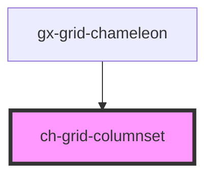

# ch-grid-columnset

<!-- Auto Generated Below -->

## Overview

The `ch-grid-columnset` component represents a group of columns.

## Dependencies

### Used by

 - [gx-grid-chameleon](../../gx-grid)

### Graph

----------------------------------------------

*Built with [StencilJS](https://stenciljs.com/)*
