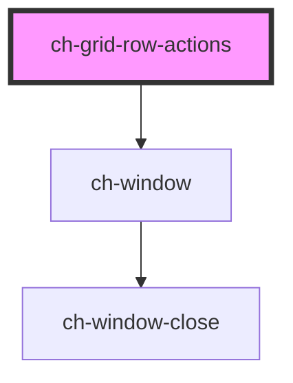

# ch-grid-row-actions

<!-- Auto Generated Below -->

## Properties

| Property           | Attribute             | Description                                                                          | Type      | Default     |
| ------------------ | --------------------- | ------------------------------------------------------------------------------------ | --------- | ----------- |
| `showOnRowActions` | `show-on-row-actions` | Indicates that the row actions are displayed when the row-actions-button is pressed. | `boolean` | `undefined` |
| `showOnRowContext` | `show-on-row-context` | Indicates that the row actions are displayed when right-clicks on the row.           | `boolean` | `undefined` |
| `showOnRowHover`   | `show-on-row-hover`   | Indicates to show row actions when hovering over row.                                | `boolean` | `undefined` |

## Events

| Event             | Description                               | Type               |
| ----------------- | ----------------------------------------- | ------------------ |
| `rowActionOpened` | Event emitted when row actions is opened. | `CustomEvent<any>` |

## Methods

### `close() => Promise<void>`

Closes the row actions window.

#### Returns

Type: `Promise<void>`

### `openRowActions(cell: HTMLElement) => Promise<void>`

Opens the row actions on the row-actions-button cell.

#### Returns

Type: `Promise<void>`

### `openRowContext(clientX: number, clientY: number) => Promise<void>`

Opens the row actions on the row-actions-button cell.

#### Returns

Type: `Promise<void>`

### `openRowHover(row: HTMLElement) => Promise<void>`

Opens the row actions on row hover.

#### Returns

Type: `Promise<void>`

## Dependencies

### Depends on

- [ch-window](../../window)

### Graph

----------------------------------------------

*Built with [StencilJS](https://stenciljs.com/)*
