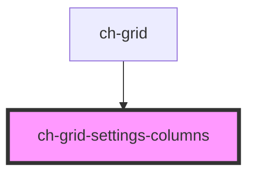

# ch-grid-settings-columns

<!-- Auto Generated Below -->

## Properties

| Property  | Attribute | Description | Type                        | Default     |
| --------- | --------- | ----------- | --------------------------- | ----------- |
| `columns` | --        |             | `HTMLChGridColumnElement[]` | `undefined` |

## Shadow Parts

| Part               | Description |
| ------------------ | ----------- |
| `"column"`         |             |
| `"column-label"`   |             |
| `"column-visible"` |             |

## Dependencies

### Used by

 - [ch-grid](../..)

### Graph

----------------------------------------------

*Built with [StencilJS](https://stenciljs.com/)*
