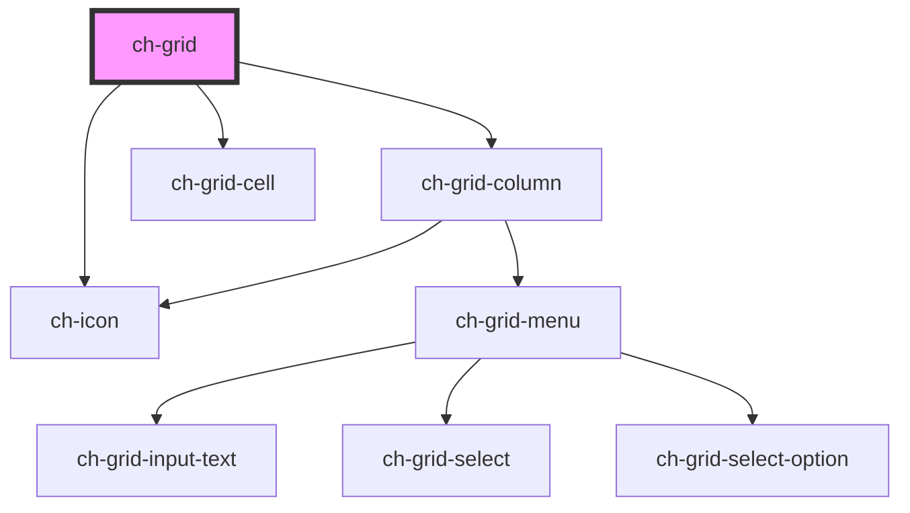

# ch-grid

<!-- Auto Generated Below -->

## Properties

| Property       | Attribute | Description | Type       | Default |
| -------------- | --------- | ----------- | ---------- | ------- |
| `freezedCols`  | --        |             | `Object[]` | `[]`    |
| `hideableCols` | --        |             | `Object[]` | `[]`    |

## Events

| Event              | Description | Type               |
| ------------------ | ----------- | ------------------ |
| `emitFreezedCols`  |             | `CustomEvent<any>` |
| `emitHideableCols` |             | `CustomEvent<any>` |

## Dependencies

### Depends on

- [ch-grid-column](../grid-column)
- [ch-grid-cell](../grid-cell)
- [ch-icon](../icon)

### Graph

---

_Built with [StencilJS](https://stenciljs.com/)_
