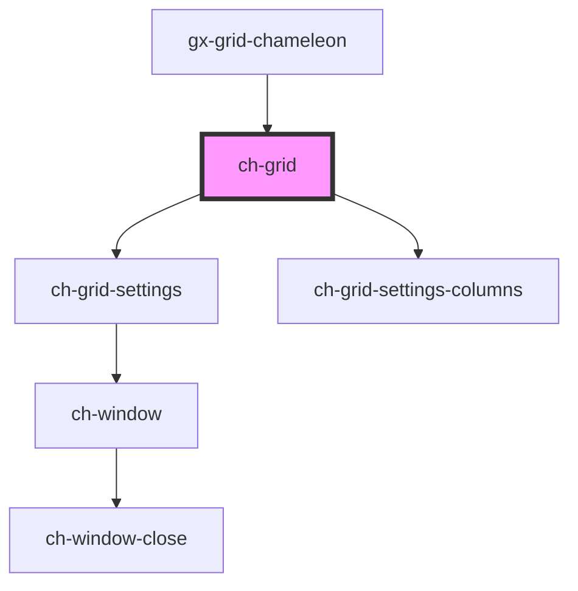

# ch-grid

<!-- Auto Generated Below -->

## Properties

| Property              | Attribute               | Description | Type                               | Default     |
| --------------------- | ----------------------- | ----------- | ---------------------------------- | ----------- |
| `localization`        | --                      |             | `GridLocalization`                 | `undefined` |
| `rowHighlightEnabled` | `row-highlight-enabled` |             | `"auto" \| boolean`                | `"auto"`    |
| `rowHighlightedClass` | `row-highlighted-class` |             | `string`                           | `undefined` |
| `rowSelectedClass`    | `row-selected-class`    |             | `string`                           | `undefined` |
| `rowSelectionMode`    | `row-selection-mode`    |             | `"multiple" \| "none" \| "single"` | `"single"`  |

## Events

| Event              | Description | Type                                       |
| ------------------ | ----------- | ------------------------------------------ |
| `rowClicked`       |             | `CustomEvent<ChGridRowClickedEvent>`       |
| `selectionChanged` |             | `CustomEvent<ChGridSelectionChangedEvent>` |

## Methods

### `cellEnsureVisible(cellId: string) => Promise<void>`

#### Returns

Type: `Promise<void>`

### `rowEnsureVisible(rowId: string) => Promise<void>`

#### Returns

Type: `Promise<void>`

## Shadow Parts

| Part                 | Description |
| -------------------- | ----------- |
| `"footer"`           |             |
| `"header"`           |             |
| `"main"`             |             |
| `"row-actions"`      |             |
| `"settings-columns"` |             |

## Dependencies

### Used by

 - [gx-grid-chameleon](../gx-grid)

### Depends on

- [ch-grid-settings](grid-settings)
- [ch-grid-settings-columns](./grid-settings/grid-settings-columns)

### Graph

----------------------------------------------

*Built with [StencilJS](https://stenciljs.com/)*
