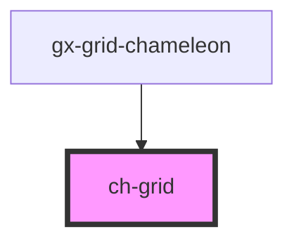

# ch-grid

<!-- Auto Generated Below -->

## Properties

| Property                | Attribute                  | Description | Type                               | Default     |
| ----------------------- | -------------------------- | ----------- | ---------------------------------- | ----------- |
| `onRowHighlightedClass` | `on-row-highlighted-class` |             | `string`                           | `undefined` |
| `onRowSelectedClass`    | `on-row-selected-class`    |             | `string`                           | `undefined` |
| `rowSelectionMode`      | `row-selection-mode`       |             | `"multiple" \| "none" \| "single"` | `'single'`  |

## Events

| Event              | Description | Type                                       |
| ------------------ | ----------- | ------------------------------------------ |
| `cellClicked`      |             | `CustomEvent<ChGridCellClickedEvent>`      |
| `selectionChanged` |             | `CustomEvent<ChGridSelectionChangedEvent>` |

## Dependencies

### Used by

- [gx-grid-chameleon](../gx-grid)

### Graph

---

_Built with [StencilJS](https://stenciljs.com/)_
