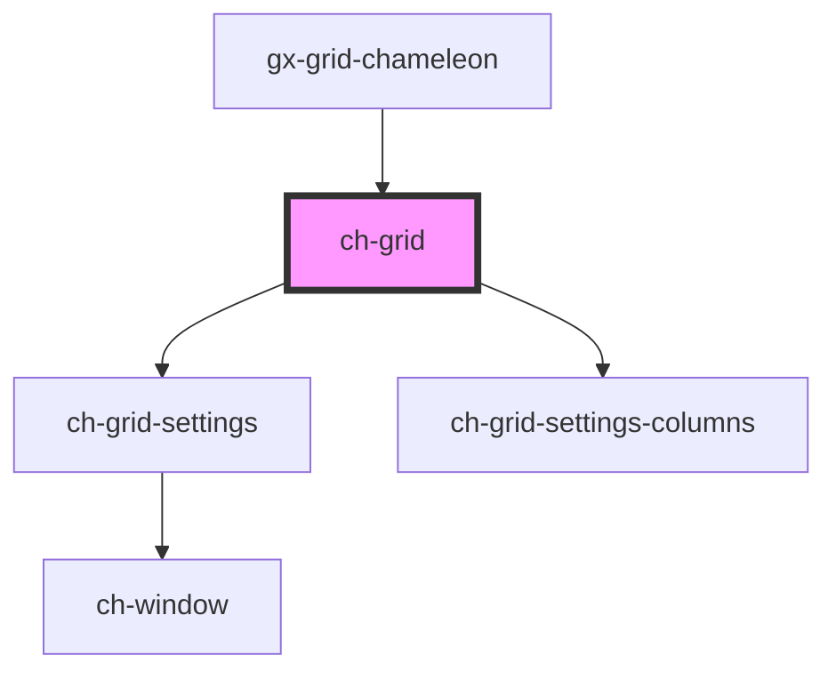

# ch-grid

<!-- Auto Generated Below -->

## Properties

| Property                | Attribute                  | Description | Type                               | Default     |
| ----------------------- | -------------------------- | ----------- | ---------------------------------- | ----------- |
| `localization`          | --                         |             | `GridLocalization`                 | `undefined` |
| `onRowHighlightedClass` | `on-row-highlighted-class` |             | `string`                           | `undefined` |
| `onRowSelectedClass`    | `on-row-selected-class`    |             | `string`                           | `undefined` |
| `rowSelectionMode`      | `row-selection-mode`       |             | `"multiple" \| "none" \| "single"` | `"single"`  |

## Events

| Event              | Description | Type                                       |
| ------------------ | ----------- | ------------------------------------------ |
| `rowClicked`       |             | `CustomEvent<ChGridRowClickedEvent>`       |
| `selectionChanged` |             | `CustomEvent<ChGridSelectionChangedEvent>` |

## Shadow Parts

| Part                 | Description |
| -------------------- | ----------- |
| `"footer"`           |             |
| `"header"`           |             |
| `"main"`             |             |
| `"row-actions"`      |             |
| `"settings-columns"` |             |

## Dependencies

### Used by

 - [gx-grid-chameleon](../gx-grid)

### Depends on

- [ch-grid-settings](../grid-settings)
- [ch-grid-settings-columns](../grid-settings/grid-settings-columns)

### Graph

----------------------------------------------

*Built with [StencilJS](https://stenciljs.com/)*
