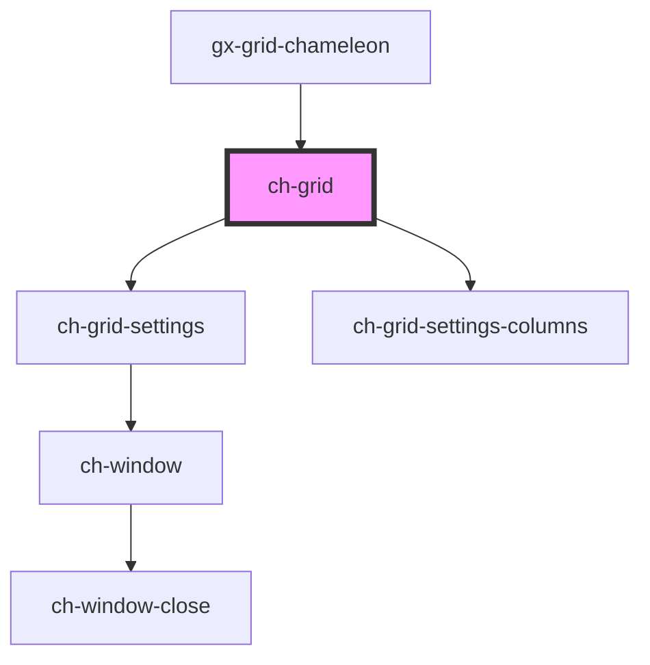

# ch-grid

<!-- Auto Generated Below -->

## Properties

| Property              | Attribute               | Description                                                                                                                                                                                                                                      | Type                               | Default     |
| --------------------- | ----------------------- | ------------------------------------------------------------------------------------------------------------------------------------------------------------------------------------------------------------------------------------------------ | ---------------------------------- | ----------- |
| `localization`        | --                      | An object that contains localized strings for the grid.                                                                                                                                                                                          | `GridLocalization`                 | `undefined` |
| `rowHighlightEnabled` | `row-highlight-enabled` | One of "false", "true" or "auto", indicating whether or not rows can be highlighted. "auto", row highlighting will be enabled if the row selection mode is set to "single" or "multiple".                                                        | `"auto" \| boolean`                | `"auto"`    |
| `rowHighlightedClass` | `row-highlighted-class` | A CSS class name applied to a row when it is hovered.                                                                                                                                                                                            | `string`                           | `undefined` |
| `rowSelectedClass`    | `row-selected-class`    | A CSS class name applied to a row when it is selected.                                                                                                                                                                                           | `string`                           | `undefined` |
| `rowSelectionMode`    | `row-selection-mode`    | One of "none", "single" or "multiple", indicating how rows can be selected. It can be set to "none" if no rows should be selectable, "single" if only one row can be selected at a time, or "multiple" if multiple rows can be selected at once. | `"multiple" \| "none" \| "single"` | `"single"`  |

## Events

| Event              | Description                                      | Type                                       |
| ------------------ | ------------------------------------------------ | ------------------------------------------ |
| `rowClicked`       | Event emitted when a row is clicked.             | `CustomEvent<ChGridRowClickedEvent>`       |
| `selectionChanged` | Event emitted when the row selection is changed. | `CustomEvent<ChGridSelectionChangedEvent>` |

## Methods

### `cellEnsureVisible(cellId: string) => Promise<void>`

#### Returns

Type: `Promise<void>`

### `rowEnsureVisible(rowId: string) => Promise<void>`

#### Returns

Type: `Promise<void>`

## Shadow Parts

| Part                 | Description |
| -------------------- | ----------- |
| `"footer"`           |             |
| `"header"`           |             |
| `"main"`             |             |
| `"row-actions"`      |             |
| `"settings-columns"` |             |

## Dependencies

### Used by

 - [gx-grid-chameleon](../gx-grid)

### Depends on

- [ch-grid-settings](grid-settings)
- [ch-grid-settings-columns](./grid-settings/grid-settings-columns)

### Graph

----------------------------------------------

*Built with [StencilJS](https://stenciljs.com/)*
