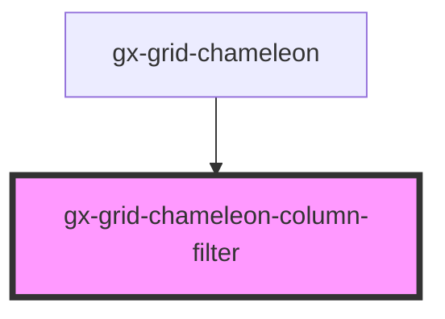

# gx-grid-chameleon-column-filter

<!-- Auto Generated Below -->

## Properties

| Property          | Attribute           | Description | Type           | Default     |
| ----------------- | ------------------- | ----------- | -------------- | ----------- |
| `buttonApplyText` | `button-apply-text` |             | `string`       | `undefined` |
| `buttonResetText` | `button-reset-text` |             | `string`       | `undefined` |
| `column`          | --                  |             | `GxGridColumn` | `undefined` |
| `equal`           | `equal`             |             | `string`       | `undefined` |
| `greater`         | `greater`           |             | `string`       | `undefined` |
| `less`            | `less`              |             | `string`       | `undefined` |

## Events

| Event                   | Description | Type                                            |
| ----------------------- | ----------- | ----------------------------------------------- |
| `columnSettingsChanged` |             | `CustomEvent<GridChameleonColumnFilterChanged>` |

## Shadow Parts

| Part        | Description |
| ----------- | ----------- |
| `"apply"`   |             |
| `"button"`  |             |
| `"caption"` |             |
| `"footer"`  |             |
| `"main"`    |             |
| `"reset"`   |             |

## Dependencies

### Used by

 - [gx-grid-chameleon](..)

### Graph

----------------------------------------------

*Built with [StencilJS](https://stenciljs.com/)*
