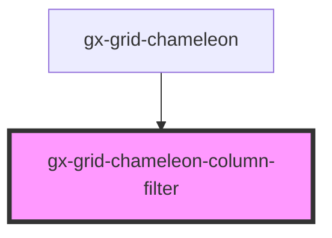

# gx-grid-chameleon-column-filter

<!-- Auto Generated Below -->

## Overview

Represents a component that provides filtering controls for a grid column.

## Properties

| Property              | Attribute           | Description                                      | Type           | Default     |
| --------------------- | ------------------- | ------------------------------------------------ | -------------- | ----------- |
| `buttonApplyText`     | `button-apply-text` | The text to display on the "Apply" button.       | `string`       | `undefined` |
| `buttonResetText`     | `button-reset-text` | The text to display on the "Reset" button.       | `string`       | `undefined` |
| `column` _(required)_ | --                  | The grid column associated with this filter.     | `GxGridColumn` | `undefined` |
| `equal`               | `equal`             | The value to filter for equality comparison.     | `string`       | `undefined` |
| `greater`             | `greater`           | The value to filter for greater-than comparison. | `string`       | `undefined` |
| `less`                | `less`              | The value to filter for less-than comparison.    | `string`       | `undefined` |

## Events

| Event                   | Description                                                                                                 | Type                                            |
| ----------------------- | ----------------------------------------------------------------------------------------------------------- | ----------------------------------------------- |
| `columnSettingsChanged` | Emitted when the filter settings for the column have changed. This event carries the updated filter values. | `CustomEvent<GridChameleonColumnFilterChanged>` |

## Shadow Parts

| Part        | Description |
| ----------- | ----------- |
| `"apply"`   |             |
| `"button"`  |             |
| `"caption"` |             |
| `"footer"`  |             |
| `"main"`    |             |
| `"reset"`   |             |

## Dependencies

### Used by

 - [gx-grid-chameleon](..)

### Graph

----------------------------------------------

*Built with [StencilJS](https://stenciljs.com/)*
