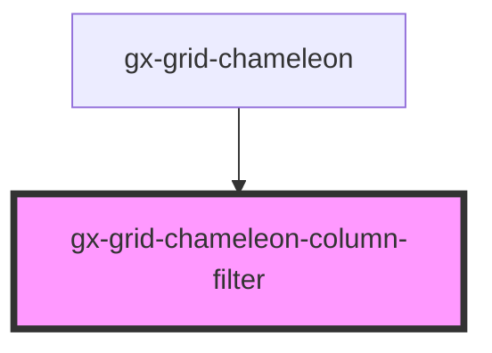

# gx-grid-chameleon-column-filter

<!-- Auto Generated Below -->

## Properties

| Property  | Attribute | Description | Type           | Default     |
| --------- | --------- | ----------- | -------------- | ----------- |
| `column`  | --        |             | `GxGridColumn` | `undefined` |
| `equal`   | `equal`   |             | `string`       | `undefined` |
| `greater` | `greater` |             | `string`       | `undefined` |
| `less`    | `less`    |             | `string`       | `undefined` |

## Events

| Event                   | Description | Type                                            |
| ----------------------- | ----------- | ----------------------------------------------- |
| `columnSettingsChanged` |             | `CustomEvent<GridChameleonColumnFilterChanged>` |

## Dependencies

### Used by

 - [gx-grid-chameleon](..)

### Graph

----------------------------------------------

*Built with [StencilJS](https://stenciljs.com/)*
