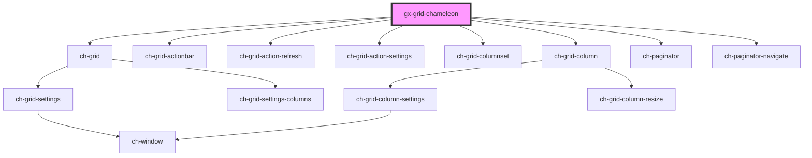

# gx-grid-chameleon

<!-- Auto Generated Below -->

## Properties

| Property        | Attribute        | Description | Type                 | Default     |
| --------------- | ---------------- | ----------- | -------------------- | ----------- |
| `grid`          | --               |             | `GxGrid`             | `undefined` |
| `gridTimestamp` | `grid-timestamp` |             | `number`             | `undefined` |
| `state`         | --               |             | `GridChameleonState` | `undefined` |

## Dependencies

### Depends on

- [ch-grid](../grid)
- [ch-grid-actionbar](../grid-actionbar)
- [ch-grid-action-refresh](../grid-action/grid-action-refresh)
- [ch-grid-action-settings](../grid-action/grid-action-settings)
- [ch-grid-columnset](../grid-columnset)
- [ch-grid-column](../grid-column)
- [ch-paginator](../paginator)
- [ch-paginator-navigate](../paginator-navigate)

### Graph

----------------------------------------------

*Built with [StencilJS](https://stenciljs.com/)*
