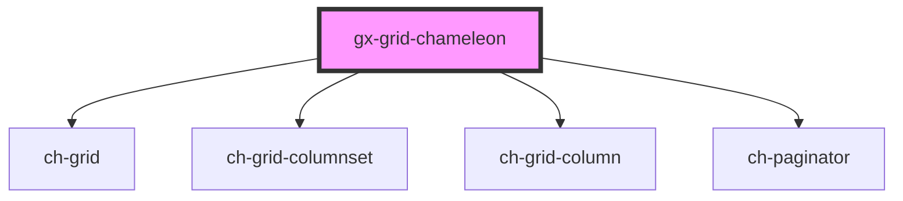

# gx-grid-chameleon

<!-- Auto Generated Below -->

## Properties

| Property        | Attribute        | Description | Type     | Default     |
| --------------- | ---------------- | ----------- | -------- | ----------- |
| `grid`          | --               |             | `GxGrid` | `undefined` |
| `gridTimestamp` | `grid-timestamp` |             | `number` | `undefined` |

## Dependencies

### Depends on

- [ch-grid](../grid)
- [ch-grid-columnset](../grid-columnset)
- [ch-grid-column](../grid-column)
- [ch-paginator](../paginator)

### Graph

---

_Built with [StencilJS](https://stenciljs.com/)_
