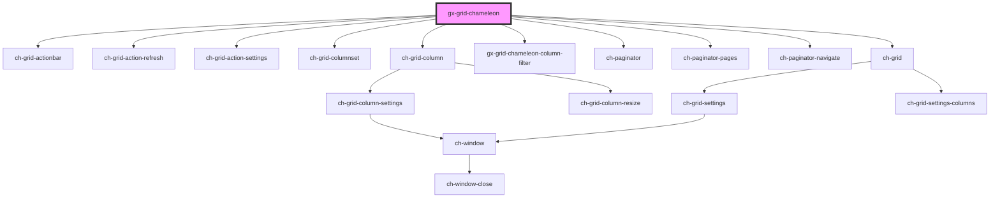

# gx-grid-chameleon

<!-- Auto Generated Below -->

## Properties

| Property            | Attribute        | Description                                                            | Type                 | Default     |
| ------------------- | ---------------- | ---------------------------------------------------------------------- | -------------------- | ----------- |
| `grid` _(required)_ | --               | The GxGrid instance representing the data to be displayed in the grid. | `GxGrid`             | `undefined` |
| `gridTimestamp`     | `grid-timestamp` | The timestamp indicating the time when the grid was last updated.      | `number`             | `undefined` |
| `state`             | --               | The UI state of the Grid.                                              | `GridChameleonState` | `undefined` |

## Dependencies

### Depends on

- [ch-grid-actionbar](../../deprecated-components/grid/grid-actionbar)
- [ch-grid-action-refresh](../../deprecated-components/grid/grid-actionbar/grid-action-refresh)
- [ch-grid-action-settings](../../deprecated-components/grid/grid-actionbar/grid-action-settings)
- [ch-grid-columnset](../../deprecated-components/grid/grid-columnset)
- [ch-grid-column](../../deprecated-components/grid/grid-column)
- [gx-grid-chameleon-column-filter](gx-grid-column-filter)
- [ch-paginator](../paginator)
- [ch-paginator-pages](../paginator/paginator-pages)
- [ch-paginator-navigate](../paginator/paginator-navigate)
- [ch-grid](../../deprecated-components/grid)

### Graph

----------------------------------------------

*Built with [StencilJS](https://stenciljs.com/)*
