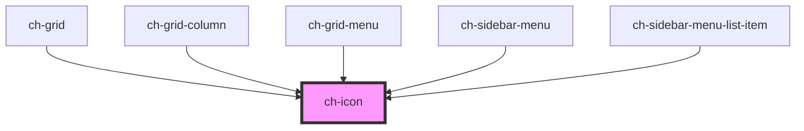

# ch-icon

A component for displaying SVG icons that allows overriding the `fill` property by setting the `--icon-color` property.

<!-- Auto Generated Below -->

## Properties

| Property    | Attribute    | Description                                                                   | Type      | Default |
| ----------- | ------------ | ----------------------------------------------------------------------------- | --------- | ------- |
| `autoColor` | `auto-color` | If enabled, the icon will display its inherent/natural color                  | `boolean` | `false` |
| `lazy`      | `lazy`       | If enabled, the icon will be loaded lazily when it's visible in the viewport. | `boolean` | `false` |
| `src`       | `src`        | The URL of the icon.                                                          | `string`  | `""`    |

## CSS Custom Properties

| Name           | Description                                        |
| -------------- | -------------------------------------------------- |
| `--icon-color` | Color of the icon (sets the SVG's `fill` property) |
| `--icon-size`  | Size of the icon (sets both width and height)      |

## Dependencies

### Used by

- [ch-grid](../grid)
- [ch-grid-column](../grid-column)
- [ch-grid-menu](../grid-column-menu)
- [ch-sidebar-menu](../sidebar-menu)
- [ch-sidebar-menu-list-item](../sidebar-menu-list-item)

### Graph

---

_Built with [StencilJS](https://stenciljs.com/)_
