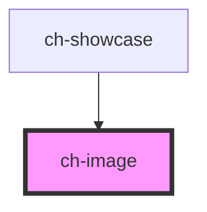

# ch-image

<!-- Auto Generated Below -->

## Overview

A control to display multiple images, depending on the state (focus, hover,
active or disabled) of a parent element.

## Properties

| Property               | Attribute  | Description                                                                                                                                                                                      | Type                                      | Default        |
| ---------------------- | ---------- | ------------------------------------------------------------------------------------------------------------------------------------------------------------------------------------------------ | ----------------------------------------- | -------------- |
| `containerRef`         | --         | Specifies a reference for the container, in order to update the state of the icon. The reference must be an ancestor of the control. If not specified, the direct parent reference will be used. | `HTMLElement`                             | `undefined`    |
| `disabled`             | `disabled` | Specifies if the icon is disabled.                                                                                                                                                               | `boolean`                                 | `false`        |
| `getImagePathCallback` | --         | This property specifies a callback that is executed when the path the image needs to be resolved.                                                                                                | `(imageSrc: string) => GxImageMultiState` | `undefined`    |
| `src`                  | `src`      | Specifies the src for the image.                                                                                                                                                                 | `string`                                  | `undefined`    |
| `type`                 | `type`     | Specifies how the image will be rendered.                                                                                                                                                        | `"background" \| "mask"`                  | `"background"` |

## CSS Custom Properties

| Name                         | Description                                                      |
| ---------------------------- | ---------------------------------------------------------------- |
| `--ch-image-background-size` | Specifies the size of the image. @default 100%                   |
| `--ch-image-size`            | Specifies the box size that contains the image. @default 0.875em |

## Dependencies

### Used by

 - [ch-showcase](../../showcase/assets/components)

### Graph

----------------------------------------------

*Built with [StencilJS](https://stenciljs.com/)*
