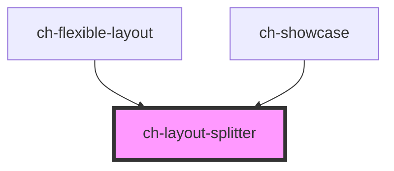

# ch-layout-splitter

This component allows us to design a layout composed by columns and rows.

- Columns and rows can have relative (`fr`) or absolute (`px`) size.
- The line that separates two columns or two rows will always have a drag-bar to resize the layout.

<!-- Auto Generated Below -->

## Properties

| Property                | Attribute                 | Description                                                                                                                  | Type                                                                                    | Default                                                         |
| ----------------------- | ------------------------- | ---------------------------------------------------------------------------------------------------------------------------- | --------------------------------------------------------------------------------------- | --------------------------------------------------------------- |
| `barAccessibleName`     | `bar-accessible-name`     | This attribute lets you specify the label for the drag bar. Important for accessibility.                                     | `string`                                                                                | `"Resize"`                                                      |
| `dragBarDisabled`       | `drag-bar-disabled`       | This attribute lets you specify if the resize operation is disabled in all drag bars. If `true`, the drag bars are disabled. | `boolean`                                                                               | `false`                                                         |
| `incrementWithKeyboard` | `increment-with-keyboard` | Specifies the resizing increment (in pixel) that is applied when using the keyboard to resize a drag bar.                    | `number`                                                                                | `2`                                                             |
| `model`                 | --                        | Specifies the list of component that are displayed. Each component will be separated via a drag bar.                         | `{ id: "root"; direction: LayoutSplitterDirection; items: LayoutSplitterItemModel[]; }` | `{     id: "root",     direction: "columns",     items: []   }` |

## Methods

### `addSiblingLeaf(parentGroup: string, siblingItem: string, placedInTheSibling: "before" | "after", leafInfo: LayoutSplitterLeafModel, takeHalfTheSpaceOfTheSiblingItem: boolean) => Promise<LayoutSplitterItemAddResult>`

#### Parameters

| Name                               | Type                                                                                                                                                                 | Description |
| ---------------------------------- | -------------------------------------------------------------------------------------------------------------------------------------------------------------------- | ----------- |
| `parentGroup`                      | `string`                                                                                                                                                             |             |
| `siblingItem`                      | `string`                                                                                                                                                             |             |
| `placedInTheSibling`               | `"after" \| "before"`                                                                                                                                                |             |
| `leafInfo`                         | `{ id: string; dragBar?: LayoutSplitterDragBarConfig; fixedOffsetSize?: number; size: LayoutSplitterSize; minSize?: `${number}px`; sticky?: LayoutSplitterSticky; }` |             |
| `takeHalfTheSpaceOfTheSiblingItem` | `boolean`                                                                                                                                                            |             |

#### Returns

Type: `Promise<LayoutSplitterItemAddResult>`

### `refreshLayout() => Promise<void>`

Schedules a new render of the control even if no state changed.

#### Returns

Type: `Promise<void>`

### `removeItem(itemId: string) => Promise<LayoutSplitterItemRemoveResult>`

Removes the item that is identified by the given ID.
The layout is rearranged depending on the state of the removed item.

#### Parameters

| Name     | Type     | Description |
| -------- | -------- | ----------- |
| `itemId` | `string` |             |

#### Returns

Type: `Promise<LayoutSplitterItemRemoveResult>`

## Shadow Parts

| Part    | Description                                  |
| ------- | -------------------------------------------- |
| `"bar"` | The bar that divides two columns or two rows |

## Dependencies

### Used by

 - [ch-flexible-layout](../flexible-layout/internal/flexible-layout)
 - [ch-showcase](../../showcase/assets/components)

### Graph

----------------------------------------------

*Built with [StencilJS](https://stenciljs.com/)*
