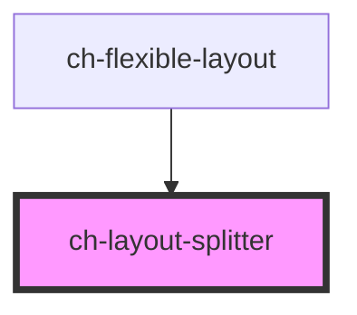

# ch-layout-splitter

This component allows us to design a layout composed by columns and rows.

- Columns and rows can have relative (`fr`) or absolute (`px`) size.
- The line that separates two columns or two rows will always have a drag-bar to resize the layout.

<!-- Auto Generated Below -->

## Properties

| Property                | Attribute                 | Description                                                                                               | Type                                                                               | Default                                         |
| ----------------------- | ------------------------- | --------------------------------------------------------------------------------------------------------- | ---------------------------------------------------------------------------------- | ----------------------------------------------- |
| `barAccessibleName`     | `bar-accessible-name`     | This attribute lets you specify the label for the drag bar. Important for accessibility.                  | `string`                                                                           | `"Resize"`                                      |
| `incrementWithKeyboard` | `increment-with-keyboard` | Specifies the resizing increment (in pixel) that is applied when using the keyboard to resize a drag bar. | `number`                                                                           | `2`                                             |
| `layout`                | --                        | Specifies the list of component that are displayed. Each component will be separated via a drag bar.      | `{ direction: LayoutSplitterDirection; items: LayoutSplitterDistributionItem[]; }` | `{     direction: "columns",     items: []   }` |

## Shadow Parts

| Part    | Description                                  |
| ------- | -------------------------------------------- |
| `"bar"` | The bar that divides two columns or two rows |

## Dependencies

### Used by

 - [ch-flexible-layout](../flexible-layout/flexible-layout)

### Graph

----------------------------------------------

*Built with [StencilJS](https://stenciljs.com/)*
