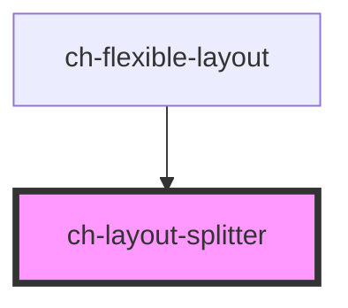

# ch-layout-splitter

<!-- Auto Generated Below -->

## Overview

The `ch-layout-splitter` component renders a nestable grid of columns and
rows with draggable bars that let users resize adjacent areas in real time.

## Features
 - Relative (`fr`) and absolute (`px`) sizing for columns and rows.
 - Draggable and keyboard-accessible separator bars between sibling items.
 - Nestable groups to produce arbitrarily complex layouts (e.g., a top-level row split into columns where one column is itself split into rows).
 - Sticky positioning support for individual items.
 - Programmatic addition and removal of leaf items at runtime.
 - Configurable drag bar size, accessibility label, and disabled state.

## Use when
 - Building user-resizable panes: code editors with side panels, master-detail views, or dashboard tiles.
 - Users need to resize two adjacent panels to fit their workflow (e.g., code editor + preview).

## Do not use when
 - Building purely static layouts that do not require interactive resizing -- prefer CSS Grid instead.
 - The layout is purely decorative with no user-adjustable panels — use CSS grid/flexbox instead.

## Accessibility
 - Each drag bar has `role="separator"` with `aria-orientation` (`vertical` or `horizontal`).
 - Bars expose `aria-controls` referencing the adjacent panels, `aria-valuetext` with the current size, `aria-label`, and `aria-disabled`.
 - Bars are focusable (`tabindex="0"`) and support keyboard resizing with Arrow keys.
## Properties

| Property                | Attribute                 | Description                                                                                                                  | Type                                                                                    | Default                                                         |
| ----------------------- | ------------------------- | ---------------------------------------------------------------------------------------------------------------------------- | --------------------------------------------------------------------------------------- | --------------------------------------------------------------- |
| `barAccessibleName`     | `bar-accessible-name`     | This attribute lets you specify the label for the drag bar. Important for accessibility.                                     | `string`                                                                                | `"Resize"`                                                      |
| `dragBarDisabled`       | `drag-bar-disabled`       | This attribute lets you specify if the resize operation is disabled in all drag bars. If `true`, the drag bars are disabled. | `boolean`                                                                               | `false`                                                         |
| `incrementWithKeyboard` | `increment-with-keyboard` | Specifies the resizing increment (in pixel) that is applied when using the keyboard to resize a drag bar.                    | `number`                                                                                | `2`                                                             |
| `model`                 | --                        | Specifies the list of component that are displayed. Each component will be separated via a drag bar.                         | `{ id: "root"; direction: LayoutSplitterDirection; items: LayoutSplitterItemModel[]; }` | `{     id: "root",     direction: "columns",     items: []   }` |

## Methods

### `addSiblingLeaf(parentGroup: string, siblingItem: string, placedInTheSibling: "before" | "after", leafInfo: LayoutSplitterLeafModel, takeHalfTheSpaceOfTheSiblingItem: boolean) => Promise<LayoutSplitterItemAddResult>`

#### Parameters

| Name                               | Type                                                                                                                                                                 | Description |
| ---------------------------------- | -------------------------------------------------------------------------------------------------------------------------------------------------------------------- | ----------- |
| `parentGroup`                      | `string`                                                                                                                                                             |             |
| `siblingItem`                      | `string`                                                                                                                                                             |             |
| `placedInTheSibling`               | `"after" \| "before"`                                                                                                                                                |             |
| `leafInfo`                         | `{ id: string; dragBar?: LayoutSplitterDragBarConfig; fixedOffsetSize?: number; size: LayoutSplitterSize; minSize?: `${number}px`; sticky?: LayoutSplitterSticky; }` |             |
| `takeHalfTheSpaceOfTheSiblingItem` | `boolean`                                                                                                                                                            |             |

#### Returns

Type: `Promise<LayoutSplitterItemAddResult>`

### `refreshLayout() => Promise<void>`

Schedules a new render of the control even if no state changed.

#### Returns

Type: `Promise<void>`

### `removeItem(itemId: string) => Promise<LayoutSplitterItemRemoveResult>`

Removes the item that is identified by the given ID.
The layout is rearranged depending on the state of the removed item.

#### Parameters

| Name     | Type     | Description |
| -------- | -------- | ----------- |
| `itemId` | `string` |             |

#### Returns

Type: `Promise<LayoutSplitterItemRemoveResult>`

## Slots

| Slot          | Description                                                                 |
| ------------- | --------------------------------------------------------------------------- |
| `"{item.id}"` | Named slot projected inside each leaf item. One slot per leaf in the model. |

## Shadow Parts

| Part          | Description                                                                                                                                |
| ------------- | ------------------------------------------------------------------------------------------------------------------------------------------ |
| `"bar"`       | The drag bar separator that divides two columns or two rows. May include an additional custom part when the item specifies `dragBar.part`. |
| `"{item.id}"` | Exposed on every group container, enabling per-item styling from outside the shadow DOM.                                                   |

## Dependencies

### Used by

 - [ch-flexible-layout](../flexible-layout/internal/flexible-layout)

### Graph

```mermaid
graph TD;
  ch-flexible-layout --> ch-layout-splitter
  style ch-layout-splitter fill:#f9f,stroke:#333,stroke-width:4px
```

----------------------------------------------

*Built with [StencilJS](https://stenciljs.com/)*
