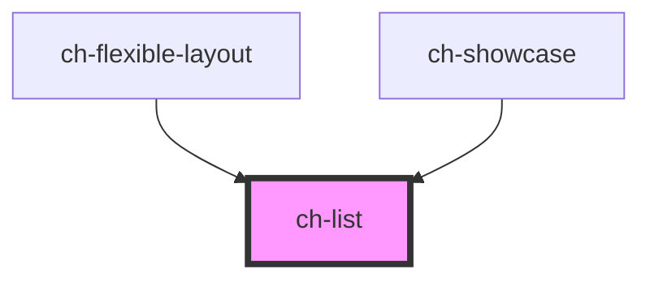

# ch-list

<!-- Auto Generated Below -->

## Properties

| Property                    | Attribute                      | Description                                                                                                                                                                                                                | Type                     | Default     |
| --------------------------- | ------------------------------ | -------------------------------------------------------------------------------------------------------------------------------------------------------------------------------------------------------------------------- | ------------------------ | ----------- |
| `accessibleName`            | `accessible-name`              | Specifies a short string, typically 1 to 3 words, that authors associate with an element to provide users of assistive technologies with a label for the element.                                                          | `string`                 | `undefined` |
| `closeButtonAccessibleName` | `close-button-accessible-name` | Specifies a short string, typically 1 to 3 words, that authors associate with an element to provide users of assistive technologies with a label for the element. This label is used for the close button of the captions. | `string`                 | `"Close"`   |
| `closeButtonHidden`         | `close-button-hidden`          | `true` to hide the close button in the items.                                                                                                                                                                              | `boolean`                | `false`     |
| `direction`                 | `direction`                    | Specifies the flexible layout type.                                                                                                                                                                                        | `"block" \| "inline"`    | `undefined` |
| `dragOutsideDisabled`       | `drag-outside-disabled`        | When the control is sortable, the items can be dragged outside of the tab-list. This property lets you specify if this behavior is disabled.                                                                               | `boolean`                | `false`     |
| `expanded`                  | `expanded`                     | `true` if the group has is view section expanded. Otherwise, only the toolbar will be displayed.                                                                                                                           | `boolean`                | `true`      |
| `model`                     | --                             | Specifies the items of the tab control.                                                                                                                                                                                    | `FlexibleLayoutWidget[]` | `undefined` |
| `selectedId`                | `selected-id`                  | Specifies the selected item of the widgets array.                                                                                                                                                                          | `string`                 | `undefined` |
| `showCaptions`              | `show-captions`                | `true` to show the captions of the items.                                                                                                                                                                                  | `boolean`                | `true`      |
| `sortable`                  | `sortable`                     | `true` to enable sorting the tab buttons by dragging them in the tab-list. If sortable !== true, the tab buttons can not be dragged out either.                                                                            | `boolean`                | `false`     |

## Events

| Event                | Description                                                                                             | Type                                                                                           |
| -------------------- | ------------------------------------------------------------------------------------------------------- | ---------------------------------------------------------------------------------------------- |
| `expandMainGroup`    | Fired when an item of the main group is double clicked.                                                 | `CustomEvent<string>`                                                                          |
| `itemClose`          | Fired the close button of an item is clicked.                                                           | `CustomEvent<{ itemId: string; itemIndex: number; }>`                                          |
| `itemDragStart`      | Fired the first time a caption button is dragged outside of its tab list.                               | `CustomEvent<number>`                                                                          |
| `selectedItemChange` | Fired when the selected item change. This event can be default prevented to prevent the item selection. | `CustomEvent<{ lastSelectedIndex: number; newSelectedId: string; newSelectedIndex: number; }>` |

## Methods

### `endDragPreview() => Promise<void>`

Ends the preview of the dragged item. Useful for ending the preview via
keyboard interaction.

#### Returns

Type: `Promise<void>`

### `getDraggableViews() => Promise<DraggableViewInfo>`

Returns the info associated to the draggable view.

#### Returns

Type: `Promise<DraggableViewInfo>`

### `promoteDragPreviewToTopLayer() => Promise<void>`

Promotes the drag preview to the top layer. Useful to avoid z-index issues.

#### Returns

Type: `Promise<void>`

### `removePage(pageId: string, forceRerender?: boolean) => Promise<void>`

Given an id, remove the page from the render

#### Parameters

| Name            | Type      | Description |
| --------------- | --------- | ----------- |
| `pageId`        | `string`  |             |
| `forceRerender` | `boolean` |             |

#### Returns

Type: `Promise<void>`

## Dependencies

### Used by

 - [ch-flexible-layout](../flexible-layout/internal/flexible-layout)
 - [ch-showcase](../../showcase/assets/components)

### Graph

----------------------------------------------

*Built with [StencilJS](https://stenciljs.com/)*
