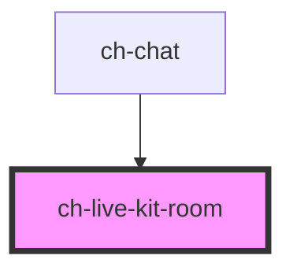

# ch-live-kit-room

<!-- Auto Generated Below -->

## Properties

| Property            | Attribute            | Description                                      | Type                                                                                                                                                                                                                                                                                          | Default     |
| ------------------- | -------------------- | ------------------------------------------------ | --------------------------------------------------------------------------------------------------------------------------------------------------------------------------------------------------------------------------------------------------------------------------------------------- | ----------- |
| `callbacks`         | --                   | Specifies the callbacks required in the control. | `{ activeSpeakersChanged?: (participant: Participant[]) => void; connectionEvents?: LiveKitConnectionListener; muteMic?: () => void; unmuteMic?: () => void; updateTranscriptions?: (segments: TranscriptionSegment[], participant?: Participant, publication?: TrackPublication) => void; }` | `undefined` |
| `connected`         | `connected`          | Specifies the room state.                        | `boolean`                                                                                                                                                                                                                                                                                     | `false`     |
| `microphoneEnabled` | `microphone-enabled` | Specifies the microphone state.                  | `boolean`                                                                                                                                                                                                                                                                                     | `false`     |
| `token`             | `token`              | Specifies the token to connect to the room       | `string`                                                                                                                                                                                                                                                                                      | `""`        |
| `url`               | `url`                | Specifies the url to connect to the room         | `string`                                                                                                                                                                                                                                                                                      | `""`        |

## Dependencies

### Used by

 - [ch-chat](../chat)

### Graph

----------------------------------------------

*Built with [StencilJS](https://stenciljs.com/)*
