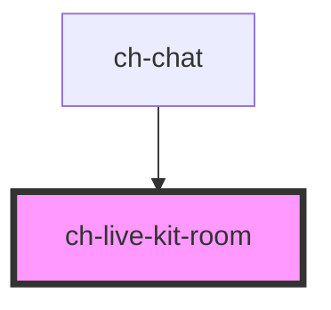

# ch-live-kit-room

<!-- Auto Generated Below -->

## Overview

The `ch-live-kit-room` component integrates with the LiveKit real-time communication platform to establish audio room connections and manage remote participants.

## Features
 - Room lifecycle management: connect, disconnect, and track remote participants via the `livekit-client` SDK.
 - Automatic attachment of remote audio tracks to dynamically rendered `<audio>` elements in the shadow DOM.
 - Local microphone toggle support via the `microphoneEnabled` property.
 - Callbacks for transcription updates, active speaker changes, mute/unmute, and connection quality via the `callbacks` property.
 - Renders a default `<slot>` for projecting custom UI (e.g., transcription display, controls).

## Use when
 - Building voice-enabled conversational experiences with LiveKit.
 - Adding real-time audio communication to a `ch-chat` component.

## Do not use when
 - You need a full video conferencing UI — use a dedicated LiveKit UI framework instead.
 - Video tracks are required — this component only handles audio tracks.

## Accessibility
 - The rendered `<audio>` elements are hidden (`display: none`) and play automatically when remote tracks are attached. No keyboard interaction is required for audio playback.
 - The host uses `display: contents`, so it does not affect the layout of slotted content.

## Properties

| Property            | Attribute            | Description                                                                                                                                                                                                                                                                                                                                                                                                                                                                                                                                                                    | Type                                                                                                                                                                                                                                                                                          | Default     |
| ------------------- | -------------------- | ------------------------------------------------------------------------------------------------------------------------------------------------------------------------------------------------------------------------------------------------------------------------------------------------------------------------------------------------------------------------------------------------------------------------------------------------------------------------------------------------------------------------------------------------------------------------------ | --------------------------------------------------------------------------------------------------------------------------------------------------------------------------------------------------------------------------------------------------------------------------------------------- | ----------- |
| `callbacks`         | --                   | Specifies the callback handlers for room events. Includes:  - `activeSpeakersChanged`: called when the list of active speakers changes.  - `updateTranscriptions`: called when transcription segments are received.  - `muteMic` / `unmuteMic`: called when the local microphone is muted/unmuted.  - `connectionEvents`: sub-callbacks for track mute/unmute, speaking state, and connection quality changes.  When `undefined`, no callbacks are invoked. This property is read during `connect()` — changing it after connection has no effect until the next reconnection. | `{ activeSpeakersChanged?: (participant: Participant[]) => void; connectionEvents?: LiveKitConnectionListener; muteMic?: () => void; unmuteMic?: () => void; updateTranscriptions?: (segments: TranscriptionSegment[], participant?: Participant, publication?: TrackPublication) => void; }` | `undefined` |
| `connected`         | `connected`          | Controls the connection state of the LiveKit room. Set to `true` to connect using the current `url` and `token`; set to `false` to disconnect.  When toggled to `true`, the component calls `connectToRoom()` and begins tracking remote participants. When toggled to `false`, the room is disconnected and audio tracks are detached.                                                                                                                                                                                                                                        | `boolean`                                                                                                                                                                                                                                                                                     | `false`     |
| `microphoneEnabled` | `microphone-enabled` | Controls whether the local participant's microphone is enabled. When `true`, the local participant publishes audio; when `false`, the mic is muted. This property is only effective while `connected` is `true`.  Toggling this property immediately enables or disables the local microphone track.                                                                                                                                                                                                                                                                           | `boolean`                                                                                                                                                                                                                                                                                     | `false`     |
| `token`             | `token`              | Specifies the LiveKit access token used to authenticate and connect to the room. The token encodes the participant identity, room name, and permissions. Must be set before `connected` is toggled to `true`.  Changing this value while connected does not trigger a reconnection — disconnect and reconnect to use a new token.                                                                                                                                                                                                                                              | `string`                                                                                                                                                                                                                                                                                      | `""`        |
| `url`               | `url`                | Specifies the WebSocket URL of the LiveKit server (e.g., `"wss://my-livekit-server.example.com"`). Must be set before `connected` is toggled to `true`.  Changing this value while connected does not trigger a reconnection — disconnect and reconnect to use a new URL.                                                                                                                                                                                                                                                                                                      | `string`                                                                                                                                                                                                                                                                                      | `""`        |

## Slots

| Slot | Description                                                                                                         |
| ---- | ------------------------------------------------------------------------------------------------------------------- |
|      | Default slot. Projects custom content (e.g., control buttons, transcription UI) within the component's shadow root. |

## Dependencies

### Used by

 - [ch-chat](../chat)

### Graph

```mermaid
graph TD;
  ch-chat --> ch-live-kit-room
  style ch-live-kit-room fill:#f9f,stroke:#333,stroke-width:4px
```

----------------------------------------------

*Built with [StencilJS](https://stenciljs.com/)*
