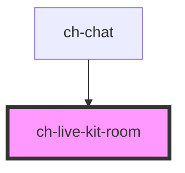

# ch-live-kit-room

<!-- Auto Generated Below -->

## Overview

The `ch-live-kit-room` component integrates with the LiveKit real-time
communication platform to establish audio room connections and manage
remote participants.

## Features
 - Room lifecycle management: connect, disconnect, and track remote participants.
 - Automatic attachment of remote audio tracks to rendered `<audio>` elements.
 - Local microphone toggle support.
 - Callbacks for transcription updates and active speaker changes.

## Use when
 - Building voice-enabled conversational experiences with LiveKit.
 - Adding real-time audio communication to a `ch-chat` component.

## Do not use when
 - You need a full video conferencing UI — use a dedicated LiveKit UI framework instead.
## Properties

| Property            | Attribute            | Description                                      | Type                                                                                                                                                                                                                                                                                          | Default     |
| ------------------- | -------------------- | ------------------------------------------------ | --------------------------------------------------------------------------------------------------------------------------------------------------------------------------------------------------------------------------------------------------------------------------------------------- | ----------- |
| `callbacks`         | --                   | Specifies the callbacks required in the control. | `{ activeSpeakersChanged?: (participant: Participant[]) => void; connectionEvents?: LiveKitConnectionListener; muteMic?: () => void; unmuteMic?: () => void; updateTranscriptions?: (segments: TranscriptionSegment[], participant?: Participant, publication?: TrackPublication) => void; }` | `undefined` |
| `connected`         | `connected`          | Specifies the room state.                        | `boolean`                                                                                                                                                                                                                                                                                     | `false`     |
| `microphoneEnabled` | `microphone-enabled` | Specifies the microphone state.                  | `boolean`                                                                                                                                                                                                                                                                                     | `false`     |
| `token`             | `token`              | Specifies the token to connect to the room       | `string`                                                                                                                                                                                                                                                                                      | `""`        |
| `url`               | `url`                | Specifies the url to connect to the room         | `string`                                                                                                                                                                                                                                                                                      | `""`        |

## Dependencies

### Used by

 - [ch-chat](../chat)

### Graph

```mermaid
graph TD;
  ch-chat --> ch-live-kit-room
  style ch-live-kit-room fill:#f9f,stroke:#333,stroke-width:4px
```

----------------------------------------------

*Built with [StencilJS](https://stenciljs.com/)*
