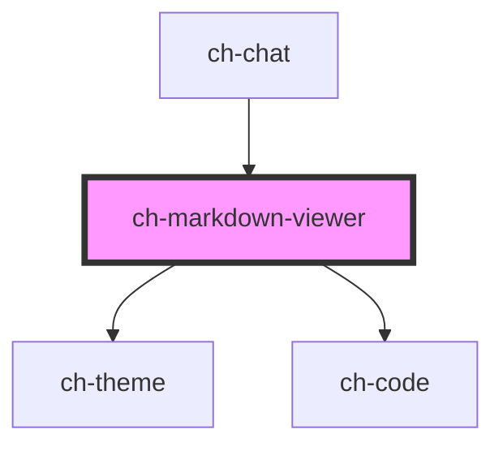

# ch-markdown-viewer

<!-- Auto Generated Below -->

## Overview

A control to render markdown syntax. It supports GitHub Flavored Markdown
(GFM) and code highlighting.
 - It parses the incoming markdown to [mdast](https://github.com/syntax-tree/mdast) using [micromark](https://github.com/micromark/micromark) via [mdast-util-from-markdown](https://github.com/syntax-tree/mdast-util-from-markdown).

- After that, it implements a reactivity layer by implementing its own render for the mdast. With this, changes to the input markdown only update the portion of the DOM that changes.

- It supports Github Flavored Markdown (GFM) by using [mdast-util-gfm](https://github.com/syntax-tree/mdast-util-gfm) and [micromark-extension-gfm](https://github.com/micromark/micromark-extension-gfm).

- It supports code highlight by parsing the incomming code of the markdown to [hast](https://github.com/micromark/micromark-extension-gfm) using [lowlight](lowlight). After that, it implements a reactivity layer by implementing its own render for the hast.

- It also supports all programming languages from [highlight.js](https://github.com/highlightjs/highlight.js).

- When the code highlighting is needed at runtime, the control will load on demand the code parser and the programming language needed to parse the code.

## Properties

| Property        | Attribute        | Description                                                                                                                              | Type                                                | Default                |
| --------------- | ---------------- | ---------------------------------------------------------------------------------------------------------------------------------------- | --------------------------------------------------- | ---------------------- |
| `rawHtml`       | `raw-html`       | `true` to render raw HTML with sanitization.                                                                                             | `boolean`                                           | `false`                |
| `renderCode`    | --               | This property allows us to implement custom rendering for the code blocks.                                                               | `(options: MarkdownViewerCodeRenderOptions) => any` | `defaultCodeRender`    |
| `showIndicator` | `show-indicator` | Specifies if an indicator is displayed in the last element rendered. Useful for streaming scenarios where a loading indicator is needed. | `boolean`                                           | `undefined`            |
| `theme`         | `theme`          | Specifies the theme to be used for rendering the control. If `undefined`, no theme will be applied.                                      | `string`                                            | `"ch-markdown-viewer"` |
| `value`         | `value`          | Specifies the markdown string to parse.                                                                                                  | `string`                                            | `undefined`            |

## Dependencies

### Used by

 - [ch-chat](../chat)

### Depends on

- [ch-theme](../theme)
- [ch-code](../code)

### Graph

----------------------------------------------

*Built with [StencilJS](https://stenciljs.com/)*
