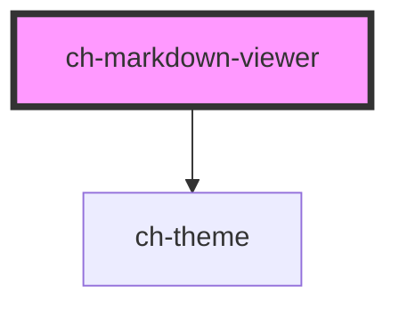

# ch-markdown-viewer

<!-- Auto Generated Below -->

## Overview

The `ch-markdown-viewer` component renders Markdown content as rich HTML with
GFM support, code highlighting, math rendering, and streaming indicators.

## Properties

| Property                      | Attribute                         | Description                                                                                                                                                                                                                                                                                                                                                                                                                                                                                       | Type                                                           | Default                |
| ----------------------------- | --------------------------------- | ------------------------------------------------------------------------------------------------------------------------------------------------------------------------------------------------------------------------------------------------------------------------------------------------------------------------------------------------------------------------------------------------------------------------------------------------------------------------------------------------- | -------------------------------------------------------------- | ---------------------- |
| `avoidFlashOfUnstyledContent` | `avoid-flash-of-unstyled-content` | `true` to visually hide the contents of the root node while the control's style is not loaded. Only works if the `theme` property is set.                                                                                                                                                                                                                                                                                                                                                         | `boolean`                                                      | `false`                |
| `extensions`                  | --                                | Specifies an array of custom extensions to extend and customize the rendered markdown language. There a 3 things needed to implement an extension:  - A tokenizer (the heavy part of the extension).  - A mapping between the custom token to the custom mdast nodes (pretty straightforward).  - A render of the custom mdast nodes in Lit's `TemplateResult` (pretty straightforward).  You can see an [example here](./examples/index.ts), which turns syntax like `Some text [[ Value ]]` to: | `MarkdownViewerExtension<object>[]`                            | `undefined`            |
| `rawHtml`                     | `raw-html`                        | `true` to render raw HTML with sanitization.                                                                                                                                                                                                                                                                                                                                                                                                                                                      | `boolean`                                                      | `false`                |
| `renderCode`                  | --                                | This property allows us to implement custom rendering for the code blocks.                                                                                                                                                                                                                                                                                                                                                                                                                        | `(options: MarkdownViewerCodeRenderOptions) => TemplateResult` | `undefined`            |
| `showIndicator`               | `show-indicator`                  | Specifies if an indicator is displayed in the last element rendered. Useful for streaming scenarios where a loading indicator is needed.                                                                                                                                                                                                                                                                                                                                                          | `boolean`                                                      | `false`                |
| `theme`                       | `theme`                           | Specifies the theme to be used for rendering the control. If `undefined`, no theme will be applied.                                                                                                                                                                                                                                                                                                                                                                                               | `string`                                                       | `"ch-markdown-viewer"` |
| `value`                       | `value`                           | Specifies the markdown string to parse.                                                                                                                                                                                                                                                                                                                                                                                                                                                           | `string`                                                       | `undefined`            |

## Dependencies

### Depends on

- [ch-theme](../theme)

### Graph

```mermaid
graph TD;
  ch-markdown-viewer --> ch-theme
  style ch-markdown-viewer fill:#f9f,stroke:#333,stroke-width:4px
```

----------------------------------------------

*Built with [StencilJS](https://stenciljs.com/)*
