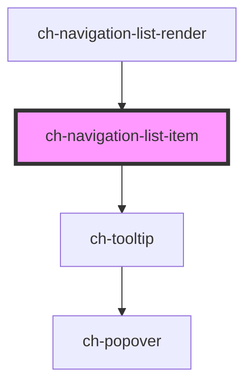

# ch-navigation-list-item

<!-- Auto Generated Below -->

## Properties

| Property                   | Attribute                    | Description                                                                                                                                                                                                                            | Type                                                                                                                                                                                                      | Default        |
| -------------------------- | ---------------------------- | -------------------------------------------------------------------------------------------------------------------------------------------------------------------------------------------------------------------------------------- | --------------------------------------------------------------------------------------------------------------------------------------------------------------------------------------------------------- | -------------- |
| `caption` _(required)_     | `caption`                    | Specifies the caption of the control                                                                                                                                                                                                   | `string`                                                                                                                                                                                                  | `undefined`    |
| `disabled`                 | `disabled`                   | This attribute lets you specify if the element is disabled. If disabled, it will not fire any user interaction related event (for example, click event).                                                                               | `boolean`                                                                                                                                                                                                 | `false`        |
| `expandable`               | `expandable`                 | Specifies if the control contains sub items.                                                                                                                                                                                           | `boolean`                                                                                                                                                                                                 | `true`         |
| `expandableButton`         | `expandable-button`          | Specifies what kind of expandable button is displayed in the items by default.  - `"decorative"`: Only a decorative icon is rendered to display the state     of the item.                                                             | `"decorative" \| "no"`                                                                                                                                                                                    | `"decorative"` |
| `expandableButtonPosition` | `expandable-button-position` | Specifies the position of the expandable button in reference of the action element of the items  - `"start"`: Expandable button is placed before the action element.  - `"end"`: Expandable button is placed after the action element. | `"end" \| "start"`                                                                                                                                                                                        | `"start"`      |
| `expanded`                 | `expanded`                   | Specifies if the control is expanded or collapsed.                                                                                                                                                                                     | `boolean`                                                                                                                                                                                                 | `undefined`    |
| `getImagePathCallback`     | --                           | This property specifies a callback that is executed when the path for an startImgSrc needs to be resolved.                                                                                                                             | `(imageSrc: NavigationListItemModel) => GxImageMultiState`                                                                                                                                                | `undefined`    |
| `level` _(required)_       | `level`                      | Specifies at which level of the navigation list is rendered the control.                                                                                                                                                               | `number`                                                                                                                                                                                                  | `undefined`    |
| `link`                     | --                           |                                                                                                                                                                                                                                        | `{ url: string; }`                                                                                                                                                                                        | `undefined`    |
| `model` _(required)_       | --                           | Specifies the UI model of the control                                                                                                                                                                                                  | `{ id?: string; caption: string; disabled?: boolean; expanded?: boolean; metadata?: string; startImgSrc?: string; startImgType?: "mask" \| "background"; link?: ItemLink; items?: NavigationListModel; }` | `undefined`    |
| `navigationListExpanded`   | `navigation-list-expanded`   | Specifies if the navigation-list parent is expanded or collapsed.                                                                                                                                                                      | `boolean`                                                                                                                                                                                                 | `true`         |
| `selected`                 | `selected`                   | Specifies if the hyperlink is selected. Only applies when the `link` property is defined.                                                                                                                                              | `boolean`                                                                                                                                                                                                 | `false`        |
| `selectedLinkIndicator`    | `selected-link-indicator`    | Specifies if the selected item indicator is displayed when the item is selected. Only applies when the `link` property is defined.                                                                                                     | `boolean`                                                                                                                                                                                                 | `false`        |
| `showCaptionOnCollapse`    | `show-caption-on-collapse`   | Specifies how the caption will be displayed when the navigation-list parent is collapsed                                                                                                                                               | `"inline" \| "tooltip"`                                                                                                                                                                                   | `"inline"`     |
| `startImgSrc`              | `start-img-src`              | Specifies the src of the start image.                                                                                                                                                                                                  | `string`                                                                                                                                                                                                  | `undefined`    |
| `startImgType`             | `start-img-type`             | Specifies how the start image will be rendered.                                                                                                                                                                                        | `"background" \| "mask"`                                                                                                                                                                                  | `"background"` |
| `tooltipDelay`             | `tooltip-delay`              | Specifies the delay (in ms) for the tooltip to be displayed.                                                                                                                                                                           | `number`                                                                                                                                                                                                  | `100`          |

## Dependencies

### Used by

 - [ch-navigation-list-render](../..)

### Depends on

- [ch-tooltip](../../../tooltip)

### Graph

----------------------------------------------

*Built with [StencilJS](https://stenciljs.com/)*
