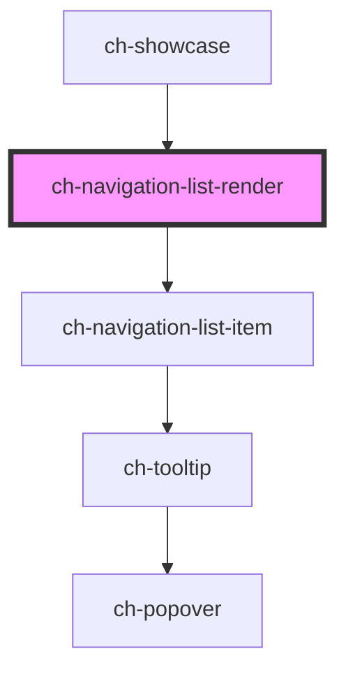

# ch-navigation-list-render

<!-- Auto Generated Below -->

## Properties

| Property                   | Attribute                    | Description                                                                                                                                                                                                                               | Type                                                                                                                | Default                              |
| -------------------------- | ---------------------------- | ----------------------------------------------------------------------------------------------------------------------------------------------------------------------------------------------------------------------------------------- | ------------------------------------------------------------------------------------------------------------------- | ------------------------------------ |
| `autoGrow`                 | `auto-grow`                  | If `false` the overflowing content of the control will be clipped to the borders of its container.                                                                                                                                        | `boolean`                                                                                                           | `false`                              |
| `expandSelectedLink`       | `expand-selected-link`       | `true` to expand the path to the selected link when the `selectedLink` property is updated.                                                                                                                                               | `boolean`                                                                                                           | `false`                              |
| `expandableButton`         | `expandable-button`          | Specifies what kind of expandable button is displayed in the items by default.  - `"decorative"`: Only a decorative icon is rendered to display the state     of the item.                                                                | `"decorative" \| "no"`                                                                                              | `"decorative"`                       |
| `expandableButtonPosition` | `expandable-button-position` | Specifies the position of the expandable button in reference of the action element of the items  - `"before"`: Expandable button is placed before the action element.  - `"after"`: Expandable button is placed after the action element. | `"after" \| "before"`                                                                                               | `"before"`                           |
| `expanded`                 | `expanded`                   | Specifies if the control is expanded or collapsed.                                                                                                                                                                                        | `boolean`                                                                                                           | `true`                               |
| `getImagePathCallback`     | --                           | This property specifies a callback that is executed when the path for an startImgSrc needs to be resolved.                                                                                                                                | `(item: NavigationListItemModel) => GxImageMultiState`                                                              | `undefined`                          |
| `gxImageConstructor`       | --                           | This property is a WA to implement the Tree View as a UC 2.0 in GeneXus.                                                                                                                                                                  | `(name: string) => any`                                                                                             | `undefined`                          |
| `gxSettings`               | `gx-settings`                | This property is a WA to implement the Tree View as a UC 2.0 in GeneXus.                                                                                                                                                                  | `any`                                                                                                               | `undefined`                          |
| `model`                    | --                           | Specifies the items of the control.                                                                                                                                                                                                       | `NavigationListItemModel[]`                                                                                         | `undefined`                          |
| `renderItem`               | --                           | Specifies the items of the control.                                                                                                                                                                                                       | `(item: NavigationListItemModel, navigationListState: ChNavigationListRender, level: number, index: number) => any` | `defaultRender`                      |
| `selectedItemIndicator`    | `selected-item-indicator`    | Specifies if the selected item indicator is displayed (only work for hyperlink)                                                                                                                                                           | `boolean`                                                                                                           | `false`                              |
| `selectedLink`             | --                           | Specifies the current selected hyperlink.                                                                                                                                                                                                 | `{ id?: string; link: ItemLink; }`                                                                                  | `{     link: { url: undefined }   }` |
| `showCaptionOnCollapse`    | `show-caption-on-collapse`   | Specifies how the caption of the items will be displayed when the control is collapsed                                                                                                                                                    | `"inline" \| "tooltip"`                                                                                             | `"inline"`                           |
| `tooltipDelay`             | `tooltip-delay`              | Specifies the delay (in ms) for the tooltip to be displayed.                                                                                                                                                                              | `number`                                                                                                            | `100`                                |
| `useGxRender`              | `use-gx-render`              | This property is a WA to implement the Navigation List as a UC 2.0 in GeneXus.                                                                                                                                                            | `boolean`                                                                                                           | `false`                              |

## Events

| Event            | Description                                                      | Type                                                                                                                                                                                                                   |
| ---------------- | ---------------------------------------------------------------- | ---------------------------------------------------------------------------------------------------------------------------------------------------------------------------------------------------------------------- |
| `buttonClick`    | Fired when an button is clicked. This event can be prevented.    | `CustomEvent<{ id?: string; caption: string; disabled?: boolean; expanded?: boolean; metadata?: string; startImgSrc?: string; startImgType?: "mask" \| "background"; link?: ItemLink; items?: NavigationListModel; }>` |
| `hyperlinkClick` | Fired when an hyperlink is clicked. This event can be prevented. | `CustomEvent<{ event: PointerEvent; item: NavigationListItemModel; }>`                                                                                                                                                 |

## CSS Custom Properties

| Name                                                                                                                                       | Description                                                                                                                                      |
| ------------------------------------------------------------------------------------------------------------------------------------------ | ------------------------------------------------------------------------------------------------------------------------------------------------ |
| `--ch-navigation-list-collapsed-size`                                                                                                      | Specifies the inline-size when the navigation list is collapsed @default var(--ch-sidebar-inline-size--collapsed, auto)                          |
| `--ch-navigation-list-item-custom-padding-inline-start`                                                                                    | Specifies an additional value for the padding-inline-start of the items without breaking the indentation of the items. @default 0px              |
| `--ch-navigation-list-item-expand-collapse-duration Specifies duration of the expand and collapse animation @default 0ms`                  |                                                                                                                                                  |
| `--ch-navigation-list-item-expand-collapse-timing-function Specifies timing function of the expand and collapse animation @default linear` |                                                                                                                                                  |
| `--ch-navigation-list-item-gap`                                                                                                            | Specifies the spacing between the images, text and the expandable button of the items. @default 0px                                              |
| `--ch-navigation-list-item__expandable-button-image-size`                                                                                  | Specifies the image size of the expandable button. @default 100%                                                                                 |
| `--ch-navigation-list-item__expandable-button-size`                                                                                        | Specifies the expandable button size of the items. @default 0.875em                                                                              |
| `--ch-navigation-list-item__image-size`                                                                                                    | Specifies the box size that contains the start image of the items. @default 0.875em                                                              |
| `--ch-navigation-list-item__tooltip-separation`                                                                                            | Specifies the separation between the action and the displayed tooltip. @default 0px                                                              |
| `--ch-navigation-list-item__tooltip-separation-x`                                                                                          | Specifies the separation between the action and the tooltip displayed on the x-axis. @default var(--ch-navigation-list-item__tooltip-separation) |
| `--ch-navigation-list-item__tooltip-separation-y`                                                                                          | Specifies the separation between the action and the tooltip displayed on the y-axis. @default var(--ch-navigation-list-item__tooltip-separation) |

## Dependencies

### Used by

 - [ch-showcase](../../showcase/assets/components)

### Depends on

- [ch-navigation-list-item](./internal/navigation-list-item)

### Graph

----------------------------------------------

*Built with [StencilJS](https://stenciljs.com/)*
