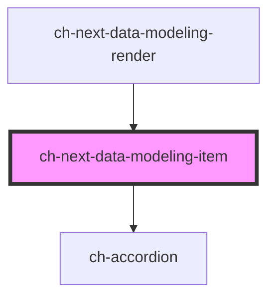

# ch-next-data-modeling-item

<!-- Auto Generated Below -->

## Properties

| Property           | Attribute            | Description                                                                                                                                                                                                      | Type                                                                                                                                                                                                                                                                                        | Default     |
| ------------------ | -------------------- | ---------------------------------------------------------------------------------------------------------------------------------------------------------------------------------------------------------------- | ------------------------------------------------------------------------------------------------------------------------------------------------------------------------------------------------------------------------------------------------------------------------------------------- | ----------- |
| `actionsVisible`   | `actions-visible`    | This attribute lets you specify if the actions in the `mode === "add"` are visible.                                                                                                                              | `boolean`                                                                                                                                                                                                                                                                                   | `true`      |
| `captions`         | --                   | The labels used in the buttons of the items. Important for accessibility.                                                                                                                                        | `{ delete: string; editing: string; confirm: string; collection: string; cancel: string; deleting: string; edit: string; ATT: string; ENTITY: string; LEVEL: string; adding: string; addNewEntity: string; addNewField: string; deleteMode: string; newEntity: string; newField: string; }` | `undefined` |
| `dataType`         | `data-type`          | The dataType of the field.                                                                                                                                                                                       | `string`                                                                                                                                                                                                                                                                                    | `""`        |
| `disabled`         | `disabled`           | This attribute lets you specify if the element is disabled. If disabled, it will not fire any user interaction related event.                                                                                    | `boolean`                                                                                                                                                                                                                                                                                   | `false`     |
| `entityNameToATTs` | --                   | This property maps entities of the current dataModel with their corresponding ATTs.                                                                                                                              | `{ [key: string]: string[]; }`                                                                                                                                                                                                                                                              | `{}`        |
| `errorTexts`       | --                   | The error texts used for the new field input.                                                                                                                                                                    | `{ Empty: string; AlreadyDefined1: string; AlreadyDefinedEntity1: string; AlreadyDefined2: string; }`                                                                                                                                                                                       | `undefined` |
| `fieldNames`       | --                   | This property specifies the defined field names of the entity parent.                                                                                                                                            | `string[]`                                                                                                                                                                                                                                                                                  | `[]`        |
| `level`            | `level`              | This property specifies at which collection level the field is located.                                                                                                                                          | `0 \| 1 \| 2`                                                                                                                                                                                                                                                                               | `1`         |
| `maxAtts`          | `max-atts`           | Determine the maximum amount of ATTs displayed per entity.                                                                                                                                                       | `number`                                                                                                                                                                                                                                                                                    | `3`         |
| `mode`             | `mode`               | This attribute specifies the operating mode of the control                                                                                                                                                       | `"add" \| "delete" \| "edit" \| "normal"`                                                                                                                                                                                                                                                   | `"normal"`  |
| `name`             | `name`               | The name of the field.                                                                                                                                                                                           | `string`                                                                                                                                                                                                                                                                                    | `""`        |
| `readonly`         | `readonly`           | This attribute indicates that the user cannot modify the value of the control. Same as [readonly](https://developer.mozilla.org/en-US/docs/Web/HTML/Element/input#attr-readonly) attribute for `input` elements. | `boolean`                                                                                                                                                                                                                                                                                   | `false`     |
| `showNewFieldBtn`  | `show-new-field-btn` | `true` to show the new field button when `mode === "add"`                                                                                                                                                        | `boolean`                                                                                                                                                                                                                                                                                   | `true`      |
| `type`             | `type`               | The type of the field.                                                                                                                                                                                           | `"ATT" \| "ENTITY" \| "LEVEL"`                                                                                                                                                                                                                                                              | `"LEVEL"`   |

## Events

| Event                 | Description                                                                                                       | Type                                                    |
| --------------------- | ----------------------------------------------------------------------------------------------------------------- | ------------------------------------------------------- |
| `deleteField`         | Fired when the item is confirmed to be deleted                                                                    | `CustomEvent<any>`                                      |
| `editField`           | Fired when the item is edited                                                                                     | `CustomEvent<{ name: string; type?: EntityItemType; }>` |
| `firstNewField`       | Fired when a new file is committed to be added when adding a new entity (level === 0)                             | `CustomEvent<{ name: string; type?: EntityItemType; }>` |
| `firstNewFieldErrors` | Fired when the new field of the new entity tries to commits the adding operation, but fails because it has errors | `CustomEvent<any>`                                      |
| `newEntity`           | Fired when a new entity is committed to be added                                                                  | `CustomEvent<{ name: string; level: ItemInfo[]; }>`     |
| `newField`            | Fired when a new file is committed to be added                                                                    | `CustomEvent<{ name: string; type?: EntityItemType; }>` |

## Methods

### `checkErrors(errors: "yes" | "no" | "unknown", event: CustomEvent | UIEvent) => Promise<void>`

Check errors in the item when `level !== 0`

#### Parameters

| Name     | Type                          | Description |
| -------- | ----------------------------- | ----------- |
| `errors` | `"no" \| "unknown" \| "yes"`  |             |
| `event`  | `UIEvent \| CustomEvent<any>` |             |

#### Returns

Type: `Promise<void>`

### `clearInput() => Promise<void>`

Remove the value of the input when mode === "add" | "edit"

#### Returns

Type: `Promise<void>`

### `delete(event: UIEvent) => Promise<void>`

Deletes the field.

#### Parameters

| Name    | Type      | Description |
| ------- | --------- | ----------- |
| `event` | `UIEvent` |             |

#### Returns

Type: `Promise<void>`

### `hideWaitingMode() => Promise<void>`

Hides the waiting mode to continue editing the field.

#### Returns

Type: `Promise<void>`

### `setAddingMode() => Promise<void>`

Set the adding mode for the first field of the entity.

#### Returns

Type: `Promise<void>`

## Slots

| Slot      | Description                                        |
| --------- | -------------------------------------------------- |
| `"items"` | The first level items (entities) of the data model |

## Dependencies

### Used by

 - [ch-next-data-modeling-render](../data-modeling-render)

### Depends on

- [ch-accordion](../../../deprecated-components/accordion)

### Graph

----------------------------------------------

*Built with [StencilJS](https://stenciljs.com/)*
